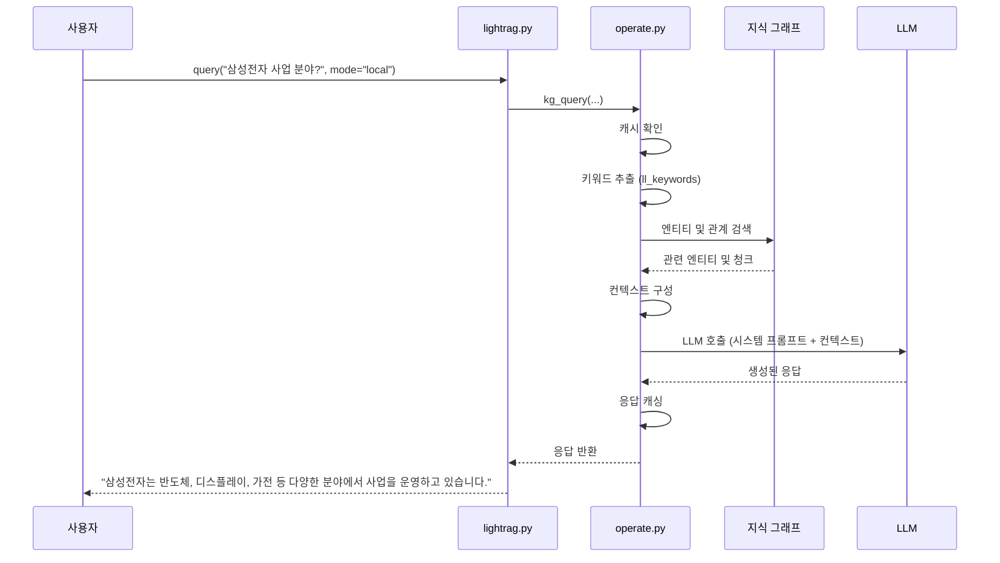
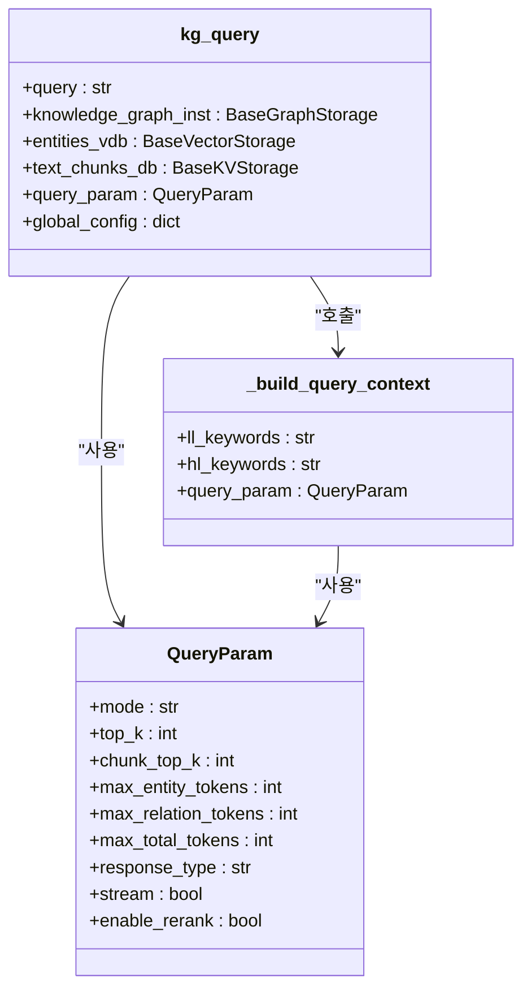

# 로컬 검색 모드

<cite>
**이 문서에서 참조한 파일**  
- [lightrag.py](file://lightrag/lightrag.py)
- [operate.py](file://lightrag/operate.py)
- [base.py](file://lightrag/base.py)
- [prompt.py](file://lightrag/prompt.py)
</cite>

## 목차
1. [소개](#소개)
2. [로컬 검색 모드의 작동 원리](#로컬-검색-모드의-작동-원리)
3. [핵심 구성 요소 분석](#핵심-구성-요소-분석)
4. [쿼리 파라미터의 역할](#쿼리-파라미터의-역할)
5. [로컬 검색의 데이터 흐름](#로컬-검색의-데이터-흐름)
6. [사용 사례 및 예시](#사용-사례-및-예시)
7. [성능 및 정확도 특성](#성능-및-정확도-특성)
8. [결론](#결론)

## 소개

로컬 검색 모드는 LightRAG 시스템에서 쿼리와 관련된 특정 엔티티를 중심으로 주변 지식을 탐색하는 검색 전략입니다. 이 모드는 사용자가 특정 개체나 개념에 대해 심층적인 정보를 요청할 때 가장 효과적으로 작동하며, 높은 정확도를 제공하지만 검색 범위는 상대적으로 제한적입니다. 예를 들어, "삼성전자의 주요 사업 분야는?"과 같은 질문에 대해 삼성전자라는 엔티티를 중심으로 연결된 관계와 관련된 텍스트 청크를 기반으로 응답을 생성합니다.

이 문서는 로컬 검색 모드의 내부 작동 원리, 핵심 구성 요소, 데이터 흐름 및 주요 파라미터를 심층적으로 분석합니다.

## 로컬 검색 모드의 작동 원리

로컬 검색 모드는 `lightrag.py` 파일의 `query` 메서드가 `mode="local"`로 호출될 때 활성화됩니다. 이 호출은 내부적으로 `operate.py` 파일의 `kg_query` 함수를 실행시키며, 엔티티 중심의 그래프 탐색을 수행합니다.

로컬 검색의 핵심은 지식 그래프(Knowledge Graph)를 활용하여 쿼리에서 추출된 키워드와 관련된 엔티티를 중심으로 정보를 확장하는 것입니다. 이 과정은 다음과 같은 단계로 이루어집니다:

1.  **쿼리 분석 및 키워드 추출**: 사용자의 쿼리를 분석하여 고수준 및 저수준 키워드를 추출합니다.
2.  **엔티티 중심 탐색**: 추출된 저수준 키워드를 기반으로 지식 그래프에서 관련 엔티티를 검색합니다.
3.  **주변 지식 확장**: 검색된 엔티티와 연결된 관계 및 관련 텍스트 청크를 탐색하여 컨텍스트를 구성합니다.
4.  **응답 생성**: 구성된 컨텍스트를 기반으로 LLM(Large Language Model)이 최종 응답을 생성합니다.

이 모드는 지식 그래프의 연결 구조를 활용하여 관련 정보를 정밀하게 탐색하므로, 특정 주제에 대한 깊이 있는 답변을 제공하는 데 적합합니다.

**Section sources**
- [lightrag.py](file://lightrag/lightrag.py#L821-L843)
- [operate.py](file://lightrag/operate.py#L1917-L2073)

## 핵심 구성 요소 분석

로컬 검색 모드의 핵심은 `kg_query` 함수와 `QueryParam` 클래스의 상호작용에 있습니다. 이 두 구성 요소는 검색의 범위와 깊이를 결정짓는 핵심 파라미터를 제공합니다.

### kg_query 함수

`kg_query` 함수는 로컬 검색 모드의 핵심 로직을 담당합니다. 이 함수는 쿼리, 지식 그래프 인스턴스, 벡터 저장소, 텍스트 청크 저장소 및 `QueryParam` 객체를 입력으로 받아, 엔티티 중심의 그래프 탐색을 수행합니다.

함수의 주요 흐름은 다음과 같습니다:
1.  **캐시 확인**: 동일한 쿼리에 대한 응답이 캐시되어 있는지 확인합니다.
2.  **키워드 추출**: `get_keywords_from_query` 함수를 통해 쿼리에서 고수준 및 저수준 키워드를 추출합니다.
3.  **컨텍스트 구성**: `_build_query_context` 함수를 호출하여 지식 그래프와 벡터 저장소에서 관련 정보를 수집하고, 이를 하나의 컨텍스트로 통합합니다.
4.  **LLM 응답 생성**: 구성된 컨텍스트를 시스템 프롬프트에 주입하고, LLM을 호출하여 최종 응답을 생성합니다.
5.  **응답 캐싱**: 생성된 응답을 캐시에 저장하여 향후 동일한 쿼리에 대한 처리 속도를 향상시킵니다.



**Diagram sources**
- [operate.py](file://lightrag/operate.py#L1917-L2073)
- [lightrag.py](file://lightrag/lightrag.py#L821-L843)

### QueryParam 클래스

`QueryParam` 클래스는 검색의 동작 방식을 세부적으로 제어하는 설정을 담고 있습니다. 로컬 검색 모드에서 특히 중요한 두 가지 파라미터는 `top_k`와 `chunk_top_k`입니다.

-   **top_k**: 검색할 엔티티의 수를 결정합니다. 이 값이 높을수록 더 많은 관련 엔티티가 컨텍스트에 포함되며, 응답의 범위가 넓어질 수 있습니다.
-   **chunk_top_k**: 각 엔티티와 연결된 관련 텍스트 청크의 수를 제어합니다. 이 값은 최종적으로 LLM에 제공되는 원시 정보의 양을 조절합니다.

이러한 파라미터를 조정함으로써 사용자는 검색의 정밀도와 범위 사이에서 균형을 맞출 수 있습니다.



**Diagram sources**
- [base.py](file://lightrag/base.py#L81-L162)
- [operate.py](file://lightrag/operate.py#L2282-L2818)

## 쿼리 파라미터의 역할

`QueryParam` 객체는 로컬 검색의 정확한 동작을 정의하는 데 필수적인 구성 요소입니다. 각 파라미터는 검색 프로세스의 특정 측면을 제어합니다.

| 파라미터 | 설명 | 기본값 |
| :--- | :--- | :--- |
| **mode** | 검색 모드를 지정합니다. `"local"`로 설정하면 엔티티 중심의 탐색이 활성화됩니다. | `"mix"` |
| **top_k** | 로컬 모드에서 검색할 최대 엔티티 수를 결정합니다. | 환경 변수 `TOP_K` 또는 `60` |
| **chunk_top_k** | 각 엔티티와 연결된 검색할 최대 텍스트 청크 수를 제어합니다. | 환경 변수 `CHUNK_TOP_K` 또는 `10` |
| **max_entity_tokens** | 컨텍스트에 포함될 엔티티 설명의 최대 토큰 수를 제한합니다. | 환경 변수 `MAX_ENTITY_TOKENS` 또는 `1000` |
| **max_relation_tokens** | 컨텍스트에 포함될 관계 설명의 최대 토큰 수를 제한합니다. | 환경 변수 `MAX_RELATION_TOKENS` 또는 `1000` |
| **max_total_tokens** | LLM에 전달되는 전체 컨텍스트(엔티티, 관계, 청크, 시스템 프롬프트)의 총 토큰 수를 제한합니다. | 환경 변수 `MAX_TOTAL_TOKENS` 또는 `12000` |
| **response_type** | LLM이 생성할 응답의 형식을 지정합니다(예: '단락', '불릿 포인트'). | `"Multiple Paragraphs"` |
| **enable_rerank** | 검색된 텍스트 청크에 대해 재순위화(re-rank)를 수행할지 여부를 결정합니다. | `true` |

이러한 파라미터들은 환경 변수를 통해 전역적으로 설정되거나, 개별 쿼리에서 `QueryParam` 객체를 통해 오버라이드할 수 있습니다.

**Section sources**
- [base.py](file://lightrag/base.py#L81-L162)
- [prompt.py](file://lightrag/prompt.py#L0-L332)

## 로컬 검색의 데이터 흐름

로컬 검색 모드의 데이터 흐름은 쿼리가 입력되어 최종 응답이 생성되기까지의 정보 흐름을 보여줍니다. 이 흐름은 `lightrag.py`의 `query` 메서드에서 시작하여 `operate.py`의 `kg_query` 함수를 거쳐 지식 그래프와 벡터 저장소에 이르기까지 이루어집니다.

```mermaid
flowchart TD
A[사용자 쿼리] --> B[lightrag.py query 메서드]
B --> C{mode == "local"?}
C --> |Yes| D[operate.py kg_query 함수 호출]
C --> |No| Z[다른 모드 처리]
D --> E[QueryParam에서 top_k, chunk_top_k 추출]
E --> F[kg_query: 캐시 확인]
F --> G[kg_query: 키워드 추출]
G --> H[_build_query_context: 엔티티 중심 탐색]
H --> I[지식 그래프: 관련 엔티티 검색]
I --> J[지식 그래프: 연결된 관계 검색]
J --> K[벡터 저장소: 관련 텍스트 청크 검색]
K --> L[_build_query_context: 컨텍스트 구성]
L --> M[kg_query: LLM에 컨텍스트 전달]
M --> N[LLM: 응답 생성]
N --> O[kg_query: 응답 캐싱]
O --> P[응답 반환]
P --> Q[사용자 출력]
```

이 흐름도는 로컬 검색이 지식 그래프의 연결성을 활용하여 정보를 확장하는 방식을 명확히 보여줍니다. `top_k`와 `chunk_top_k` 파라미터는 각 단계에서 검색할 정보의 양을 제어하는 핵심 역할을 합니다.

**Diagram sources**
- [lightrag.py](file://lightrag/lightrag.py#L821-L843)
- [operate.py](file://lightrag/operate.py#L1917-L2073)

## 사용 사례 및 예시

로컬 검색 모드는 다음과 같은 시나리오에서 가장 효과적입니다:

-   **개체에 대한 심층 정보 요청**: "삼성전자의 주요 사업 분야는?", "아이작 뉴턴이 발견한 법칙은 무엇인가요?"와 같이 특정 개체에 대한 구체적인 정보를 묻는 경우.
-   **관계 기반 질문**: "김철수와 박영희의 관계는 무엇인가요?", "A 회사와 B 기술의 관계는?"과 같이 두 엔티티 간의 관계를 묻는 경우.
-   **문서 내 특정 정보 탐색**: 대량의 문서 집합에서 특정 인물, 장소, 사건에 대한 정보를 신속하게 찾을 필요가 있는 경우.

다