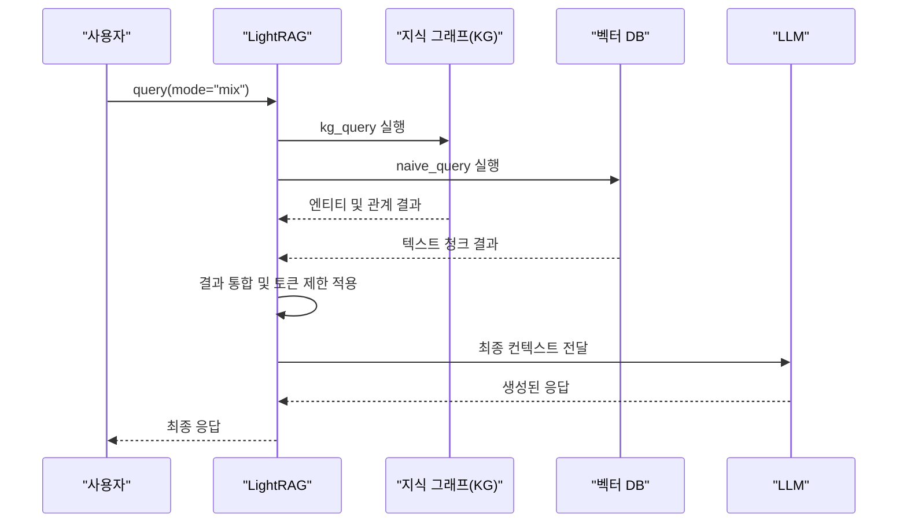

# 믹스 검색 모드

<cite>
**이 문서에서 참조된 파일**   
- [lightrag.py](file://lightrag/lightrag.py)
- [operate.py](file://lightrag/operate.py)
- [base.py](file://lightrag/base.py)
- [types.py](file://lightrag/types.py)
</cite>

## 목차
1. [소개](#소개)
2. [믹스 검색 모드의 작동 원리](#믹스-검색-모드의-작동-원리)
3. [쿼리 파라미터](#쿼리-파라미터)
4. [결과 통합 메커니즘](#결과-통합-메커니즘)
5. [사용 사례](#사용-사례)

## 소개
믹스 검색 모드는 LightRAG 시스템에서 지식 그래프(KG) 검색과 벡터 검색을 동시에 수행하여 다양한 정보 소스를 종합적으로 활용하는 고급 검색 전략입니다. 이 모드는 복잡한 질문에 대해 보다 풍부하고 정확한 응답을 생성할 수 있도록 설계되었습니다. 사용자는 `lightrag.py`의 `query` 메서드를 `mode="mix"`로 호출함으로써 이 기능을 활성화할 수 있습니다.

**Section sources**
- [lightrag.py](file://lightrag/lightrag.py#L2979-L2985)

## 믹스 검색 모드의 작동 원리
믹스 검색 모드는 두 가지 독립적인 검색 경로를 병렬로 실행합니다. 첫 번째 경로는 `kg_query` 함수를 사용하여 지식 그래프에서 엔티티와 관계를 검색하고, 두 번째 경로는 `naive_query` 함수를 사용하여 벡터 데이터베이스에서 관련 텍스트 청크를 검색합니다. 이 두 검색은 동시에 수행되며, 각각의 결과는 독립적으로 처리됩니다.

**Diagram sources**
- [lightrag.py](file://lightrag/lightrag.py#L2979-L2985)
- [operate.py](file://lightrag/operate.py#L1917-L2073)
- [operate.py](file://lightrag/operate.py#L3397-L3599)

## 쿼리 파라미터
믹스 검색 모드의 동작은 `QueryParam` 클래스의 여러 파라미터에 의해 제어됩니다. 주요 파라미터는 다음과 같습니다:

| 파라미터 | 설명 |
| :--- | :--- |
| `top_k` | 지식 그래프 검색에서 반환할 엔티티 또는 관계의 수를 제어합니다. |
| `chunk_top_k` | 벡터 검색에서 반환할 텍스트 청크의 수를 제어합니다. |
| `max_total_tokens` | 최종 컨텍스트의 총 토큰 수를 제한하여 LLM의 입력 길이를 관리합니다. |
| `kg_chunk_pick_method` | 지식 그래프에서 관련 텍스트 청크를 선택하는 방법을 결정합니다. 'WEIGHT' 또는 'VECTOR' 중 하나를 선택할 수 있습니다. |

**Section sources**
- [base.py](file://lightrag/base.py#L81-L162)
- [lightrag.py](file://lightrag/lightrag.py#L182-L182)

## 결과 통합 메커니즘
두 검색 경로의 결과는 `kg_query` 함수 내부의 `_build_query_context` 함수를 통해 통합됩니다. 이 과정은 다음과 같은 단계로 이루어집니다:

1.  **키워드 추출**: 사용자의 쿼리에서 고수준 키워드(hl_keywords)와 저수준 키워드(ll_keywords)를 추출합니다.
2.  **KG 검색**: 추출된 키워드를 사용하여 지식 그래프에서 관련 엔티티와 관계를 검색합니다.
3.  **벡터 검색**: 원본 쿼리를 사용하여 벡터 데이터베이스에서 관련 텍스트 청크를 검색합니다.
4.  **컨텍스트 구성**: 검색된 엔티티, 관계, 텍스트 청크를 하나의 구조화된 컨텍스트로 통합합니다.
5.  **토큰 제한 적용**: `max_total_tokens` 파라미터를 기반으로 컨텍스트의 각 부분(엔티티, 관계, 청크)에 대한 동적 토큰 제한을 적용하여 최종 컨텍스트의 크기를 조절합니다.

이 통합된 컨텍스트는 최종적으로 LLM에 전달되어 최종 응답을 생성합니다.

**Section sources**
- [operate.py](file://lightrag/operate.py#L2400-L3199)

## 사용 사례
믹스 검색 모드는 구조화된 지식과 최신 정보가 모두 필요한 복잡한 질문에 특히 유리합니다. 예를 들어, "최근 뉴스에서 언급된 기업들과 그들의 기술 동향은?"과 같은 질문을 할 경우, 벡터 검색은 최신 뉴스 기사에서 관련 텍스트 청크를 찾아내고, 지식 그래프 검색은 해당 기업들의 기술 스택, 경쟁사, 제품 라인 등과 같은 구조화된 지식을 제공합니다. 두 결과가 통합되면, 기업의 현재 동향과 그 배경에 대한 보다 포괄적이고 깊이 있는 응답을 생성할 수 있습니다.

**Section sources**
- [lightrag.py](file://lightrag/lightrag.py#L2979-L2985)