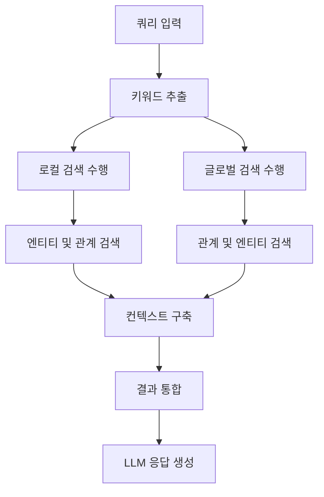
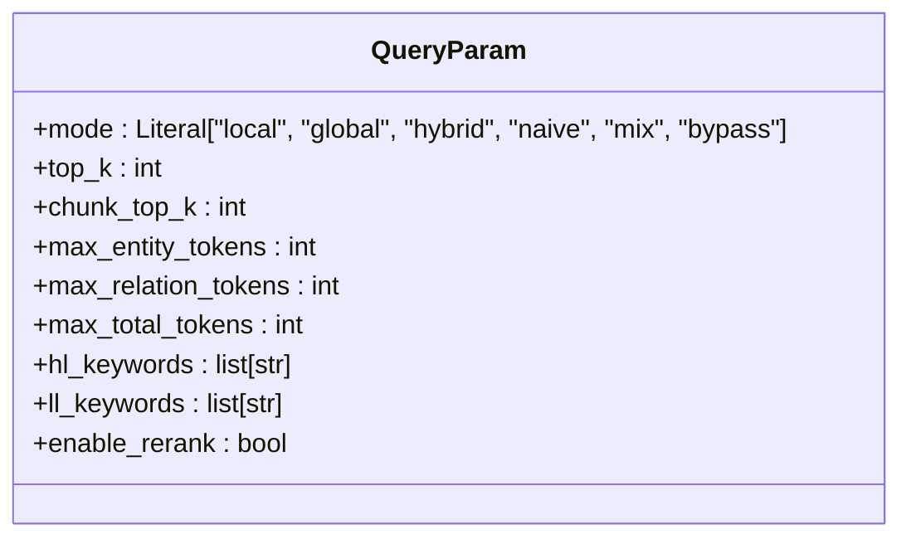
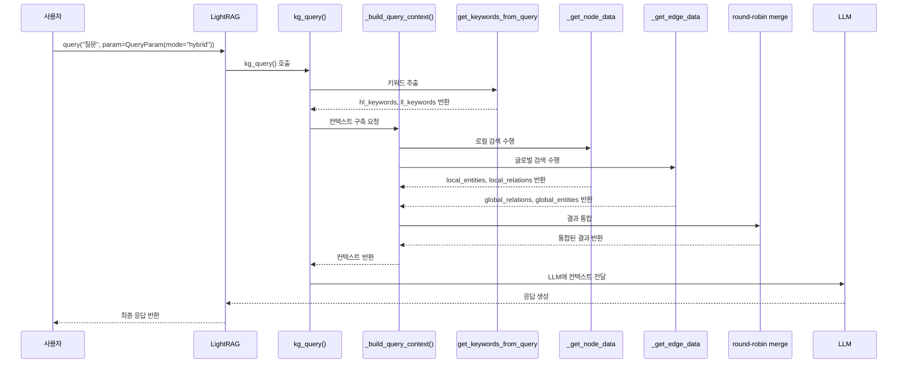
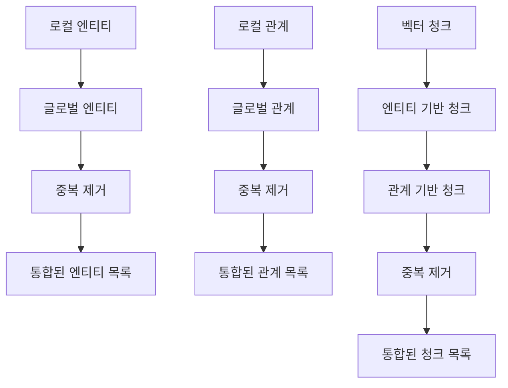
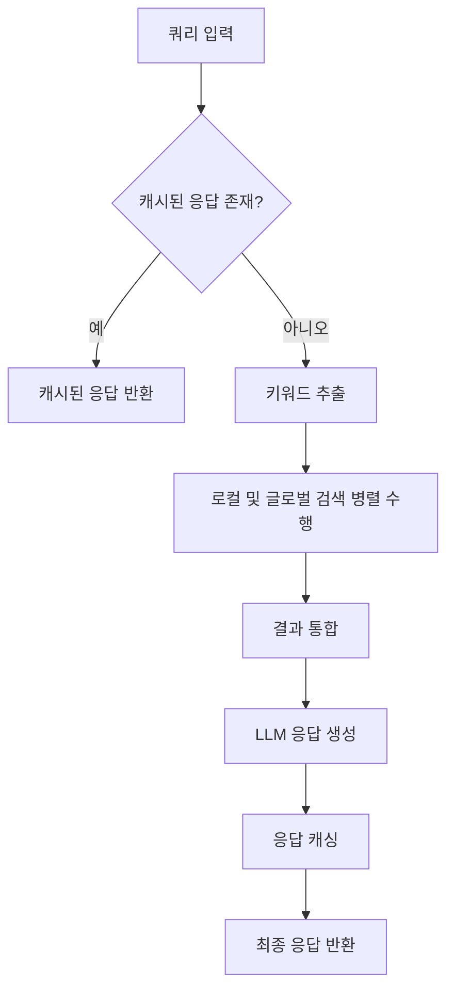

# 하이브리드 검색 모드

<cite>
**이 문서에서 참조된 파일**   
- [lightrag.py](file://lightrag/lightrag.py)
- [base.py](file://lightrag/base.py)
- [operate.py](file://lightrag/operate.py)
- [README-zh.md](file://README-zh.md)
</cite>

## 목차
1. [소개](#소개)
2. [하이브리드 검색 모드 개요](#하이브리드-검색-모드-개요)
3. [핵심 구성 요소 분석](#핵심-구성-요소-분석)
4. [쿼리 처리 흐름](#쿼리-처리-흐름)
5. [키워드 추출 및 검색 전략](#키워드-추출-및-검색-전략)
6. [컨텍스트 구축 및 토큰 제어](#컨텍스트-구축-및-토큰-제어)
7. [결과 통합 및 순차적 병합](#결과-통합-및-순차적-병합)
8. [성능 고려사항](#성능-고려사항)
9. [결론](#결론)

## 소개
하이브리드 검색 모드는 로컬 검색과 글로벌 검색의 장점을 결합하여 보다 균형 잡힌 응답을 생성하는 LightRAG의 핵심 기능입니다. 이 문서는 하이브리드 검색 모드의 내부 작동 방식, 구성 요소 및 처리 흐름을 심층적으로 분석합니다. 특히 `lightrag.py`의 `query` 메서드가 `mode="hybrid"`로 호출될 때 발생하는 일련의 프로세스를 중심으로 설명합니다.

**하이브리드 검색 모드의 주요 특징:**
- 로컬 및 글로벌 검색 전략의 통합
- 엔티티와 관계 정보의 동시 활용
- 정확도와 포괄성을 동시에 제공
- 복잡한 질문에 대한 종합적인 답변 생성

## 하이브리드 검색 모드 개요
하이브리드 검색 모드는 로컬 검색과 글로벌 검색의 결과를 결합하여 보다 균형 잡힌 응답을 생성하는 방식입니다. 이 모드는 정확도와 포괄성을 동시에 요구하는 질문에 적합하며, 두 검색 전략의 장점을 결합합니다.



**Diagram sources**
- [operate.py](file://lightrag/operate.py#L1917-L2073)
- [base.py](file://lightrag/base.py#L81-L162)

**Section sources**
- [lightrag.py](file://lightrag/lightrag.py#L0-L2928)
- [operate.py](file://lightrag/operate.py#L1900-L3600)

## 핵심 구성 요소 분석
하이브리드 검색 모드는 여러 핵심 구성 요소로 이루어져 있으며, 각 요소는 특정 역할을 수행합니다.

### QueryParam 클래스
`QueryParam` 클래스는 쿼리 실행을 위한 구성 매개변수를 정의합니다. 하이브리드 검색 모드에서 중요한 매개변수는 다음과 같습니다:

- **mode**: 검색 모드를 지정합니다. "hybrid"로 설정 시 로컬 및 글로벌 검색을 결합합니다.
- **top_k**: 로컬 모드에서는 검색할 엔티티 수를, 글로벌 모드에서는 관계 수를 나타냅니다.
- **chunk_top_k**: 벡터 검색에서 처음에 검색할 텍스트 청크 수를 결정합니다.
- **max_total_tokens**: 통합된 컨텍스트의 전체 토큰 수를 제한합니다.



**Diagram sources**
- [base.py](file://lightrag/base.py#L81-L162)

**Section sources**
- [base.py](file://lightrag/base.py#L81-L162)

## 쿼리 처리 흐름
하이브리드 검색 모드의 쿼리 처리 흐름은 다음과 같은 단계로 구성됩니다.



**Diagram sources**
- [operate.py](file://lightrag/operate.py#L1917-L2073)
- [operate.py](file://lightrag/operate.py#L2282-L2818)

**Section sources**
- [operate.py](file://lightrag/operate.py#L1917-L2073)
- [operate.py](file://lightrag/operate.py#L2282-L2818)

## 키워드 추출 및 검색 전략
하이브리드 검색 모드는 먼저 쿼리에서 키워드를 추출한 후, 이를 기반으로 검색을 수행합니다.

### 키워드 추출 프로세스
1. **고수준 키워드(hl_keywords)**: 글로벌 검색에 사용되며, 주로 관계를 중심으로 정보를 검색합니다.
2. **저수준 키워드(ll_keywords)**: 로컬 검색에 사용되며, 주로 엔티티를 중심으로 정보를 검색합니다.

```mermaid
flowchart TD
A[쿼리 입력] --> B{hl_keywords 및 ll_keywords 제공?}
B --> |예| C[제공된 키워드 사용]
B --> |아니오| D[LLM을 사용하여 키워드 추출]
D --> E[extract_keywords_only() 호출]
E --> F[JSON 형식의 키워드 데이터 파싱]
F --> G[hl_keywords, ll_keywords 반환]
C --> H[검색 수행]
G --> H
```

**Diagram sources**
- [operate.py](file://lightrag/operate.py#L1948-L1983)
- [operate.py](file://lightrag/operate.py#L2075-L2150)

**Section sources**
- [operate.py](file://lightrag/operate.py#L1948-L1983)
- [operate.py](file://lightrag/operate.py#L2075-L2150)

## 컨텍스트 구축 및 토큰 제어
하이브리드 검색 모드는 통합된 토큰 제어 시스템을 사용하여 컨텍스트를 구축합니다.

### 토큰 할당 전략
- **max_entity_tokens**: 엔티티 컨텍스트에 할당된 최대 토큰 수
- **max_relation_tokens**: 관계 컨텍스트에 할당된 최대 토큰 수
- **max_total_tokens**: 전체 쿼리 컨텍스트의 최대 토큰 예산

```mermaid
flowchart TD
A[초기 엔티티 및 관계 검색] --> B{토큰 한도 초과?}
B --> |예| C[truncate_list_by_token_size() 호출]
C --> D[JSON 직렬화 기반 토큰 제한 적용]
B --> |아니오| E[다음 단계로 진행]
D --> F[엔티티 및 관계 컨텍스트 생성]
E --> F
F --> G[최종 엔티티 및 관계 필터링]
G --> H[관련 텍스트 청크 검색]
```

**Diagram sources**
- [operate.py](file://lightrag/operate.py#L2400-L2818)

**Section sources**
- [operate.py](file://lightrag/operate.py#L2400-L2818)

## 결과 통합 및 순차적 병합
하이브리드 검색 모드는 라운드 로빈 방식으로 로컬 및 글로벌 검색 결과를 통합합니다.

### 순차적 병합 알고리즘
1. **엔티티 병합**: 로컬 검색의 엔티티를 먼저 추가한 후, 글로벌 검색의 엔티티를 추가합니다.
2. **관계 병합**: 로컬 검색의 관계를 먼저 추가한 후, 글로벌 검색의 관계를 추가합니다.
3. **청크 병합**: 벡터 청크, 엔티티 기반 청크, 관계 기반 청크를 순차적으로 병합합니다.



**Diagram sources**
- [operate.py](file://lightrag/operate.py#L2400-L2818)

**Section sources**
- [operate.py](file://lightrag/operate.py#L2400-L2818)

## 성능 고려사항
하이브리드 검색 모드는 성능을 최적화하기 위해 다양한 전략을 사용합니다.

### 병렬 처리 및 캐싱
- **병렬 검색**: 엔티티 및 관계 검색을 병렬로 수행합니다.
- **결과 캐싱**: 쿼리 결과를 캐싱하여 반복적인 검색을 방지합니다.
- **LLM 캐싱**: LLM 응답을 캐싱하여 비용을 절감합니다.



**Diagram sources**
- [operate.py](file://lightrag/operate.py#L1917-L2073)

**Section sources**
- [operate.py](file://lightrag/operate.py#L1917-L2073)

## 결론
하이브리드 검색 모드는 로컬 검색과 글로벌 검색의 장점을 결합하여 보다 균형 잡힌 응답을 생성하는 효과적인 전략입니다. 이 모드는 `QueryParam`의 `mode="hybrid"` 설정을 통해 활성화되며, `top_k`, `chunk_top_k`, `max_total_tokens` 등의 매개변수를 통해 검색 결과의 수와 토큰 예산을 제어할 수 있습니다. 복잡한 질문에 대해 엔티티와 관계를 모두 활용하여 종합적인 답변을 생성할 수 있으며, 정확도와 포괄성을 동시에 제공합니다.