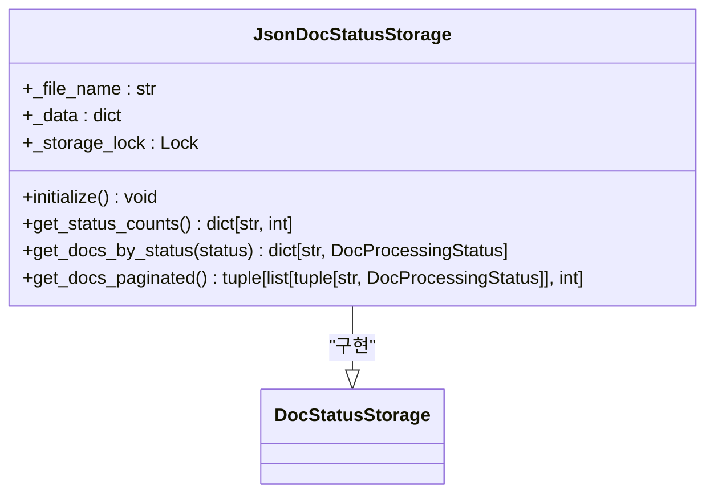
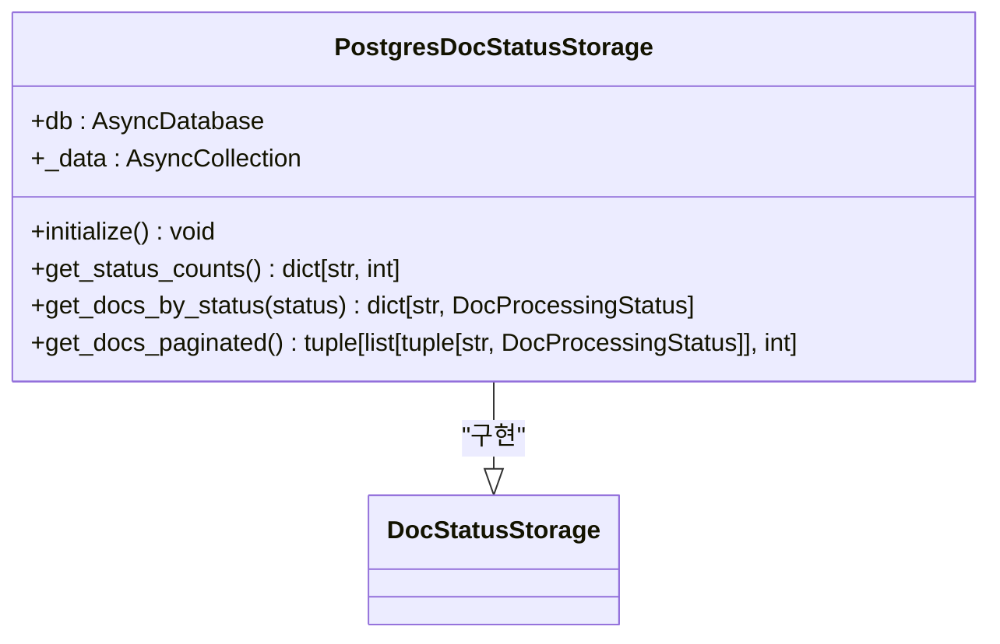
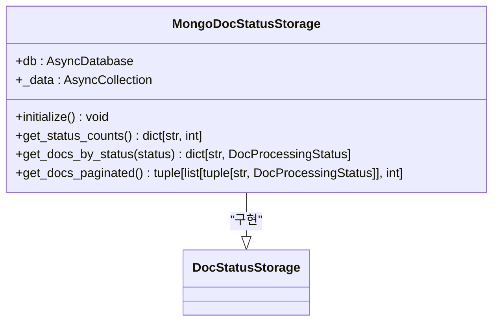
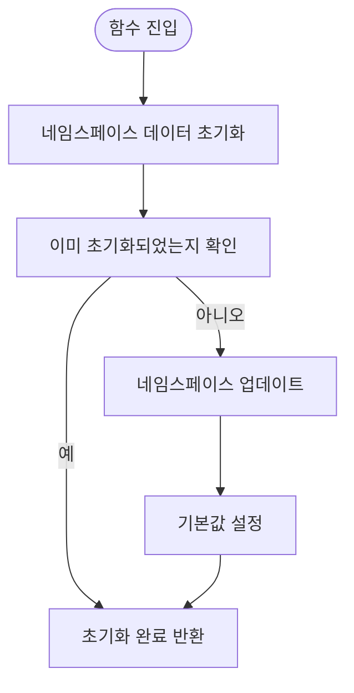
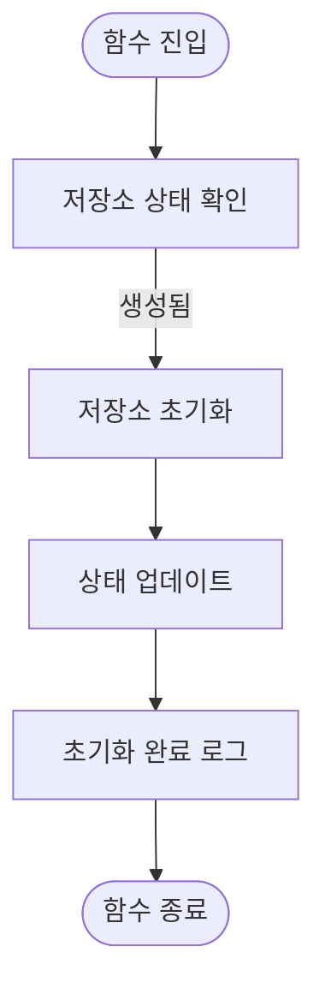
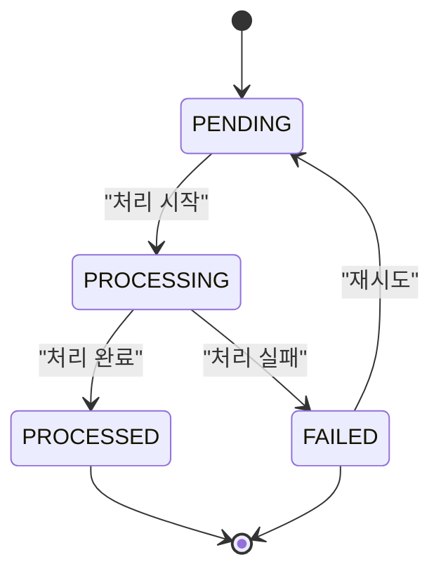
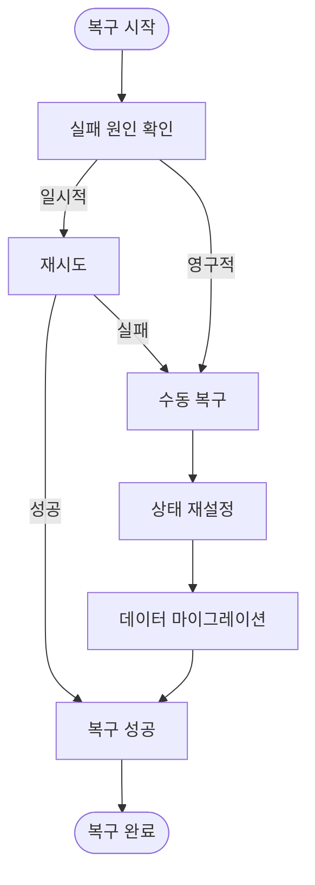

# 문서 상태 관리

<cite>
**이 문서에서 참조한 파일**   
- [base.py](file://lightrag/base.py)
- [json_doc_status_impl.py](file://lightrag/kg/json_doc_status_impl.py)
- [mongo_impl.py](file://lightrag/kg/mongo_impl.py)
- [postgres_impl.py](file://lightrag/kg/postgres_impl.py)
- [shared_storage.py](file://lightrag/kg/shared_storage.py)
- [lightrag.py](file://lightrag/lightrag.py)
</cite>

## 목차
1. [소개](#소개)
2. [DocStatusStorage 인터페이스](#docstatusstorage-인터페이스)
3. [구현체 비교](#구현체-비교)
4. [상태 전이 프로세스](#상태-전이-프로세스)
5. [복구 전략](#복구-전략)
6. [API를 통한 문서 상태 관리](#api를-통한-문서-상태-관리)
7. [파이프라인 모니터링](#파이프라인-모니터링)
8. [결론](#결론)

## 소개
LightRAG는 문서 처리 파이프라인의 상태를 추적하고 관리하기 위해 문서 상태 관리 시스템을 제공합니다. 이 시스템은 문서 삽입, 처리, 오류 상태를 효과적으로 추적할 수 있도록 설계되었습니다. 핵심 구성 요소는 `DocStatusStorage` 인터페이스와 이를 구현한 다양한 저장소 클래스들입니다. 이 문서는 문서 상태 관리 시스템의 구조, 동작 방식, 초기화 요구사항, 복구 전략 및 API 사용법을 상세히 설명합니다.

## DocStatusStorage 인터페이스
`DocStatusStorage`는 문서 상태 저장소의 기본 인터페이스로, `BaseKVStorage`를 상속받아 다양한 저장소 구현체가 일관된 방식으로 상태 정보를 관리할 수 있도록 합니다. 이 인터페이스는 문서 상태를 조회하고 관리하는 데 필요한 핵심 메서드들을 정의합니다.

### 주요 메서드
- `get_status_counts()`: 각 상태별 문서 수를 반환합니다.
- `get_docs_by_status(status)`: 특정 상태에 있는 모든 문서를 반환합니다.
- `get_docs_by_track_id(track_id)`: 특정 추적 ID를 가진 모든 문서를 반환합니다.
- `get_docs_paginated()`: 페이지네이션을 지원하여 문서를 조회합니다.
- `get_all_status_counts()`: 모든 문서의 상태별 카운트를 반환합니다.

**Section sources**
- [base.py](file://lightrag/base.py#L709-L756)

## 구현체 비교
LightRAG은 `DocStatusStorage` 인터페이스를 다양한 저장소 백엔드에 맞게 구현한 세 가지 주요 클래스를 제공합니다: `JsonDocStatusStorage`, `PostgresDocStatusStorage`, `MongoDocStatusStorage`. 각 구현체는 고유한 특성과 최적화를 가지고 있습니다.

### JsonDocStatusStorage
`JsonDocStatusStorage`는 로컬 파일 시스템에 JSON 파일로 상태 정보를 저장합니다. 간단한 설정과 낮은 오버헤드로 인해 개발 및 테스트 환경에 적합합니다.

#### 특징
- **단순성**: 파일 기반 저장으로 설정이 간단합니다.
- **성능**: 작은 데이터셋에서는 빠른 성능을 제공합니다.
- **확장성**: 멀티프로세스 환경에서 성능이 저하될 수 있습니다.



**Diagram sources**
- [json_doc_status_impl.py](file://lightrag/kg/json_doc_status_impl.py#L70-L103)

### PostgresDocStatusStorage
`PostgresDocStatusStorage`는 PostgreSQL 데이터베이스를 사용하여 상태 정보를 저장합니다. 대규모 데이터셋과 고성능 요구사항을 가진 프로덕션 환경에 적합합니다.

#### 특징
- **확장성**: 대규모 데이터셋에서도 안정적인 성능을 제공합니다.
- **신뢰성**: 트랜잭션 지원으로 데이터 무결성을 보장합니다.
- **복잡성**: 설정과 관리가 더 복잡합니다.



**Diagram sources**
- [postgres_impl.py](file://lightrag/kg/postgres_impl.py#L276-L692)

### MongoDocStatusStorage
`MongoDocStatusStorage`는 MongoDB를 사용하여 상태 정보를 저장합니다. 유연한 스키마와 높은 확장성을 제공하여 다양한 사용 사례에 적합합니다.

#### 특징
- **유연성**: 스키마가 없는 구조로 다양한 데이터 구조를 쉽게 저장할 수 있습니다.
- **확장성**: 수평 확장이 용이합니다.
- **성능**: 쿼리 성능이 우수합니다.



**Diagram sources**
- [mongo_impl.py](file://lightrag/kg/mongo_impl.py#L276-L692)

## 상태 전이 프로세스
문서 상태 관리 시스템은 문서의 처리 상태를 추적하기 위해 정의된 상태 전이 프로세스를 따릅니다. 이 프로세스는 문서 삽입부터 처리, 오류 처리까지의 전체 라이프사이클을 관리합니다.

### 초기화 요구사항
시스템은 `initialize_pipeline_status` 및 `initialize_storages` 함수를 통해 초기화됩니다. 이 초기화 과정은 파이프라인 상태를 설정하고 모든 저장소를 준비합니다.

#### initialize_pipeline_status


**Diagram sources**
- [shared_storage.py](file://lightrag/kg/shared_storage.py#L1056-L1084)

#### initialize_storages


**Diagram sources**
- [lightrag.py](file://lightrag/lightrag.py#L562-L582)

### 상태 전이 다이어그램


**Diagram sources**
- [base.py](file://lightrag/base.py#L701-L741)

## 복구 전략
저장소 실패 시, 시스템은 데이터 무결성과 서비스 지속성을 보장하기 위해 다양한 복구 전략을 제공합니다.

### 자동 복구
- **재시도 메커니즘**: 일시적인 오류에 대해 자동으로 재시도합니다.
- **백오프 전략**: 재시도 간격을 점진적으로 늘려 시스템 부하를 줄입니다.

### 수동 복구
- **상태 재설정**: 실패한 문서의 상태를 `PENDING`으로 재설정하여 재처리를 유도합니다.
- **데이터 마이그레이션**: 이전 버전의 데이터를 새로운 스키마로 마이그레이션합니다.



**Diagram sources**
- [lightrag.py](file://lightrag/lightrag.py#L1291-L1316)

## API를 통한 문서 상태 관리
API를 통해 문서 상태를 조회하고 관리할 수 있습니다. 이는 사용자 인터페이스와 통합되어 실시간으로 문서 상태를 모니터링할 수 있도록 합니다.

### 코드 예제
```python
# 문서 상태 조회
async def get_document_status(doc_id: str):
    status = await doc_status.get_by_id(doc_id)
    return status

# 문서 상태 업데이트
async def update_document_status(doc_id: str, status: DocStatus):
    await doc_status.upsert({doc_id: {"status": status.value}})
```

**Section sources**
- [json_doc_status_impl.py](file://lightrag/kg/json_doc_status_impl.py#L70-L103)
- [mongo_impl.py](file://lightrag/kg/mongo_impl.py#L276-L692)
- [postgres_impl.py](file://lightrag/kg/postgres_impl.py#L276-L692)

## 파이프라인 모니터링
상태 정보를 기반으로 파이프라인 모니터링을 구현할 수 있습니다. 이는 처리 상태, 오류 발생률, 처리 속도 등을 실시간으로 추적할 수 있도록 합니다.

### 모니터링 지표
- **처리 상태 분포**: 각 상태별 문서 수
- **처리 시간**: 문서 처리에 소요된 시간
- **오류율**: 실패한 문서의 비율

```mermaid
pieDiagram
    title 문서 상태 분포
    "처리 완료" :