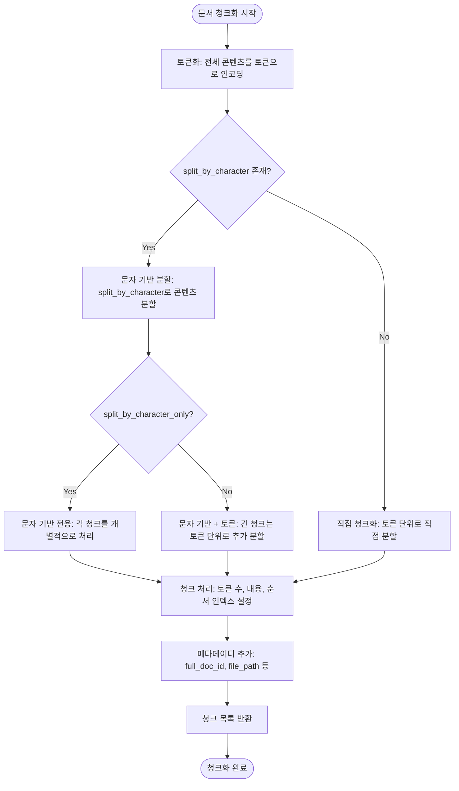
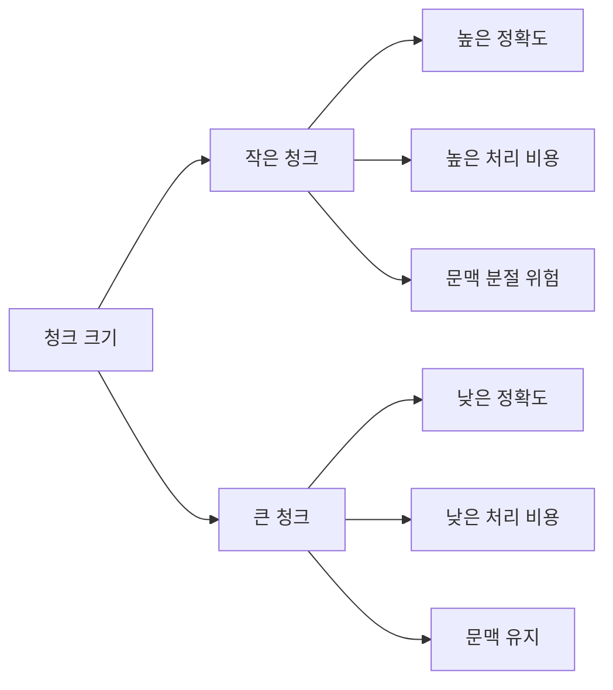
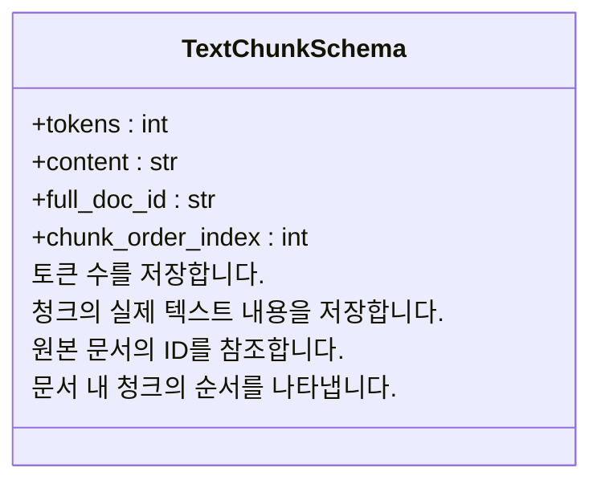

# 문서 청크화

<cite>
**이 문서에서 참조한 파일**   
- [operate.py](file://lightrag/operate.py)
- [base.py](file://lightrag/base.py)
- [lightrag.py](file://lightrag/lightrag.py)
- [document_routes.py](file://lightrag/api/routers/document_routes.py)
- [utils.py](file://lightrag/utils.py)
</cite>

## 목차
1. [소개](#소개)
2. [토큰 기반 청크화 과정](#토큰-기반-청크화-과정)
3. [청크화 파라미터 분석](#청크화-파라미터-분석)
4. [청크 메타데이터 관리](#청크-메타데이터-관리)
5. [다양한 파일 형식 처리 전략](#다양한-파일-형식-처리-전략)
6. [성능 최적화 및 문제 해결](#성능-최적화-및-문제-해결)
7. [결론](#결론)

## 소개

LightRAG는 문서를 효과적으로 처리하고 검색 가능하게 만들기 위해 정교한 문서 청크화 기능을 제공합니다. 이 문서는 `chunking_by_token_size` 함수를 중심으로 토큰 단위 청크화 과정을 상세히 설명하며, 청크화 파라미터가 시스템 성능에 미치는 영향과 다양한 파일 형식을 처리하는 내부 전략을 안내합니다. 문서 청크화는 지식 기반 시스템의 핵심 요소로, 대규모 문서를 적절한 크기의 청크로 분할하여 검색 정확도와 처리 효율성을 극대화합니다.

## 토큰 기반 청크화 과정

LightRAG의 문서 청크화는 `chunking_by_token_size` 함수를 통해 구현되며, 이 함수는 토큰 단위로 문서를 분할하는 핵심 역할을 수행합니다. 이 과정은 텍스트를 의미 있는 단위로 나누어 지식 추출과 검색의 정확도를 높이는 데 중점을 둡니다.

**청크화 과정의 핵심 단계:**

1. **토큰화**: 입력된 콘텐츠는 지정된 토크나이저를 사용하여 토큰 시퀀스로 변환됩니다. 이는 언어 모델이 텍스트를 이해하는 방식과 일치하는 정확한 청크 크기를 보장합니다.

2. **분할 전략 결정**: 함수는 `split_by_character` 매개변수의 존재 여부에 따라 두 가지 분할 전략을 선택합니다.
   - **문자 기반 분할**: 특정 문자(예: 문단 구분자)를 기준으로 먼저 분할한 후, 각 청크를 토큰 크기 제한에 맞게 추가로 처리합니다.
   - **직접 토큰 기반 분할**: 토큰 시퀀스를 직접 `chunk_token_size`와 `chunk_overlap_token_size`에 따라 분할합니다.

3. **청크 생성**: 분할된 각 청크는 토큰 수, 내용, 순서 인덱스 등의 정보를 포함하는 딕셔너리로 생성됩니다. 이 정보는 후속 처리 및 검색에 필수적입니다.

4. **중첩 처리**: `chunk_overlap_token_size` 매개변수를 사용하여 인접한 청크 간에 중첩을 생성함으로써, 의미가 청크 경계에서 끊기는 것을 방지하고 문맥의 연속성을 유지합니다.

**Section sources**
- [operate.py](file://lightrag/operate.py#L63-L115)

## 청크화 파라미터 분석

LightRAG의 청크화 과정은 `chunk_token_size`와 `chunk_overlap_token_size`라는 두 가지 핵심 설정을 통해 제어되며, 이들은 청크 생성에 결정적인 영향을 미칩니다.

### chunk_token_size

`chunk_token_size`는 각 청크의 최대 토큰 수를 정의하는 매개변수로, 기본값은 1200입니다. 이 값은 시스템의 성능과 정확도에 다음과 같은 영향을 미칩니다:

- **작은 값 (예: 512)**:
  - **장점**: 청크가 더 정밀하고 집중된 정보를 포함하므로 검색 정확도가 높아질 수 있습니다.
  - **단점**: 문서를 더 많은 청크로 분할하게 되어, 처리 및 저장 비용이 증가하고, 문맥이 과도하게 분절될 수 있습니다.

- **큰 값 (예: 2048)**:
  - **장점**: 더 넓은 문맥을 유지할 수 있어, 의미가 분절되는 것을 방지하고, 청크 수를 줄여 저장 및 검색 효율성을 높입니다.
  - **단점**: 청크가 너무 커져서 관련 없는 정보가 포함될 수 있으며, 검색 시 불필요한 정보를 로드하게 됩니다.

### chunk_overlap_token_size

`chunk_overlap_token_size`는 인접한 청크 간의 중첩 토큰 수를 정의하며, 기본값은 100입니다. 이 매개변수는 문맥의 연속성을 보장하는 데 중요한 역할을 합니다.

- **적절한 중첩 (예: 100-150)**: 문장이나 단락이 청크 경계에서 끊기는 것을 방지하여, 의미의 흐름을 자연스럽게 유지합니다.
- **과도한 중첩 (예: 300 이상)**: 청크 간 중복이 심해져 저장 공간을 낭비하고, 검색 시 중복된 결과가 나타날 수 있습니다.
- **부족한 중첩 (예: 10 이하)**: 문맥 연결이 부족하여, 청크 경계에서 의미가 끊기는 문제가 발생할 수 있습니다.

**Section sources**
- [lightrag.py](file://lightrag/lightrag.py#L1496-L1522)
- [operate.py](file://lightrag/operate.py#L63-L115)

## 청크 메타데이터 관리

LightRAG는 `TextChunkSchema`라는 데이터 구조를 활용하여 청크 메타데이터를 체계적으로 관리합니다. 이 스키마는 각 청크에 필수적인 정보를 구조화하여 저장합니다.

**TextChunkSchema의 주요 속성:**

- **tokens**: 청크의 토큰 수를 나타내며, 청크 크기 제어 및 비용 계산에 사용됩니다.
- **content**: 청크의 실제 텍스트 내용으로, 검색 및 지식 추출의 대상이 됩니다.
- **full_doc_id**: 이 청크가 속한 원본 문서의 고유 식별자로, 청크와 문서 간의 관계를 유지합니다.
- **chunk_order_index**: 문서 내에서 청크의 순서를 나타내며, 원본 문서의 구조를 재구성하는 데 필요합니다.

이 메타데이터는 `lightrag.py` 파일에서 문서 처리 파이프라인의 일부로 생성되며, 각 청크에 `full_doc_id`와 `file_path` 같은 추가 정보가 포함됩니다. 이러한 구조화된 메타데이터는 청크의 효율적인 검색, 관리 및 원본 문서로의 추적을 가능하게 합니다.

**Section sources**
- [base.py](file://lightrag/base.py#L70-L74)
- [lightrag.py](file://lightrag/lightrag.py#L1476-L1498)

## 다양한 파일 형식 처리 전략

LightRAG는 다양한 파일 형식(PDF, DOCX 등)을 처리하기 위해 유연한 내부 청크화 전략을 채택하고 있습니다. 이 전략은 파일 형식에 따라 텍스트 추출 방식을 동적으로 조정합니다.

### PDF 파일 처리

PDF 파일은 `PyPDF2` 라이브러리를 사용하여 텍스트를 추출합니다. 이 과정은 각 페이지의 텍스트를 순차적으로 추출하여 하나의 연속된 콘텐츠 문자열로 결합합니다. 실패할 경우 `docling`이라는 대체 엔진을 사용하여 마