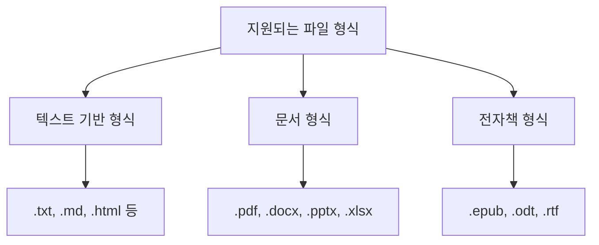
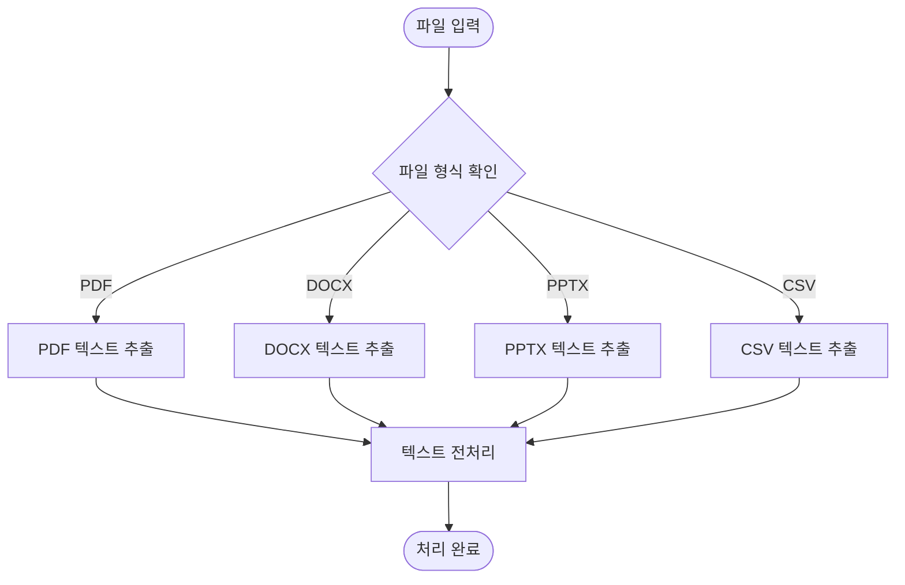
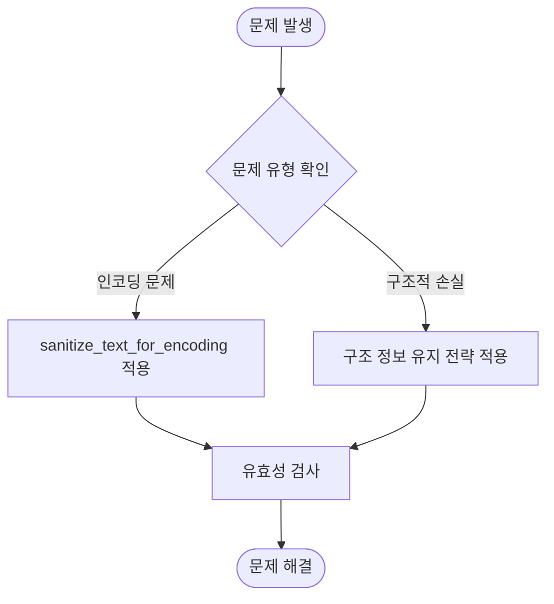
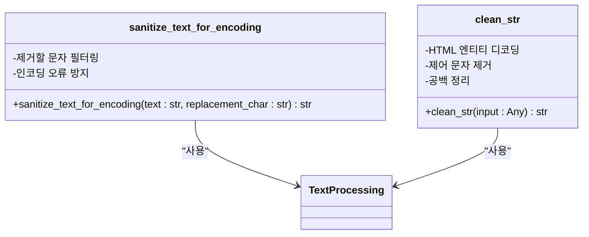

# 파일 형식 지원

<cite>
**이 문서에서 참조한 파일**  
- [document_routes.py](file://lightrag/api/routers/document_routes.py)
- [utils.py](file://lightrag/utils.py)
- [constants.ts](file://lightrag_webui/src/lib/constants.ts)
- [raganything_example.py](file://examples/raganything_example.py)
</cite>

## 목차
1. [소개](#소개)
2. [지원되는 파일 형식](#지원되는-파일-형식)
3. [내부 문서 파서 및 텍스트 추출 프로세스](#내부-문서-파서-및-텍스트-추출-프로세스)
4. [인코딩 및 구조적 손실 문제 해결](#인코딩-및-구조적-손실-문제-해결)
5. [유틸리티 함수의 활용](#유틸리티-함수의-활용)
6. [사용자 정의 파일 파서 통합](#사용자-정의-파일-파서-통합)
7. [실제 예제](#실제-예제)
8. [결론](#결론)

## 소개
LightRAG은 다양한 파일 형식을 처리할 수 있도록 설계된 고급 RAG(Retrieval-Augmented Generation) 시스템입니다. 이 문서는 LightRAG가 PDF, DOCX, PPTX, CSV 등 다양한 파일 형식을 처리하는 내부 메커니즘을 설명합니다. 문서 파서의 작동 방식, 텍스트 추출 과정, 인코딩 문제 해결 방법, 그리고 사용자 정의 파서 통합 방법을 포함하여 상세히 다룹니다.

**Section sources**
- [document_routes.py](file://lightrag/api/routers/document_routes.py#L833-L872)

## 지원되는 파일 형식
LightRAG은 광범위한 파일 형식을 지원하여 다양한 문서 유형을 처리할 수 있습니다. 지원되는 주요 파일 형식은 다음과 같습니다:

- **텍스트 기반 형식**: `.txt`, `.md`, `.html`, `.htm`, `.tex`, `.json`, `.xml`, `.yaml`, `.yml`, `.log`, `.conf`, `.ini`, `.properties`, `.sql`, `.bat`, `.sh`, `.c`, `.cpp`, `.py`, `.java`, `.js`, `.ts`, `.swift`, `.go`, `.rb`, `.php`, `.css`, `.scss`, `.less`
- **문서 형식**: `.pdf`, `.docx`, `.pptx`, `.xlsx`
- **전자책 형식**: `.epub`, `.odt`, `.rtf`

이러한 형식들은 `lightrag_webui/src/lib/constants.ts` 파일에 정의되어 있으며, 각 MIME 타입에 따라 적절한 처리 방식이 적용됩니다.



**Diagram sources**
- [constants.ts](file://lightrag_webui/src/lib/constants.ts#L40-L75)

## 내부 문서 파서 및 텍스트 추출 프로세스
LightRAG은 파일 형식에 따라 다양한 문서 파서를 사용하여 텍스트를 추출합니다. 주요 파일 형식별 처리 방식은 다음과 같습니다:

### PDF 처리
PDF 파일은 `PyPDF2` 또는 `pdfplumber`와 같은 라이브러리를 사용하여 텍스트를 추출합니다. 이 과정에서 페이지 단위로 텍스트를 분리하고, 필요한 경우 이미지 기반 텍스트도 OCR을 통해 추출할 수 있습니다.

### DOCX 처리
DOCX 파일은 `python-docx` 라이브러리를 사용하여 처리합니다. 문서의 각 단락을 순회하면서 텍스트를 추출하며, 스타일 정보는 무시하고 순수한 텍스트만 가져옵니다. 또한, `DOCLING` 엔진을 사용할 수 있도록 설정되어 있으며, 이 경우 더 정교한 마크다운 형식으로 변환됩니다.

### PPTX 처리
PPTX 파일은 `python-pptx` 라이브러리를 사용하여 처리합니다. 각 슬라이드의 도형을 순회하면서 텍스트를 추출하며, 슬라이드 제목과 본문을 구분하여 처리합니다.

### CSV 처리
CSV 파일은 `csv` 모듈을 사용하여 처리합니다. 헤더 정보를 포함하여 테이블 형식의 데이터를 구조화된 형태로 변환합니다.



**Diagram sources**
- [document_routes.py](file://lightrag/api/routers/document_routes.py#L969-L1069)

## 인코딩 및 구조적 손실 문제 해결
다양한 파일 형식을 처리할 때 발생할 수 있는 인코딩 문제와 구조적 손실 문제를 해결하기 위해 LightRAG은 다음과 같은 전략을 사용합니다:

### 인코딩 문제 해결
UTF-8 인코딩 문제를 해결하기 위해 `sanitize_text_for_encoding` 함수를 사용합니다. 이 함수는 다음과 같은 작업을 수행합니다:
- 서로게이트 문자 제거 또는 대체
- 비문자 유니코드 제거
- 제어 문자 제거
- 공백 문자 정리

### 구조적 손실 문제 해결
문서의 구조적 정보를 유지하기 위해 다음과 같은 방법을 사용합니다:
- DOCX 및 PPTX의 경우, 스타일 정보를 일부 유지하면서 텍스트를 추출
- CSV의 경우, 헤더 정보를 포함하여 테이블 구조를 유지
- PDF의 경우, 페이지 단위로 텍스트를 분리하여 문서 구조를 유지



**Diagram sources**
- [utils.py](file://lightrag/utils.py#L1568-L1642)

## 유틸리티 함수의 활용
LightRAG은 파일 처리 과정에서 여러 유틸리티 함수를 활용하여 텍스트의 품질을 향상시킵니다.

### sanitize_text_for_encoding
이 함수는 텍스트를 안전한 UTF-8 인코딩으로 변환하기 위해 설계되었습니다. 주요 기능은 다음과 같습니다:
- 서로게이트 문자 제거
- 비문자 유니코드 제거
- 제어 문자 제거
- 공백 문자 정리

### clean_str
이 함수는 입력 문자열을 정리하여 HTML 이스케이프, 제어 문자 등을 제거합니다. 주로 다음과 같은 작업을 수행합니다:
- HTML 엔티티 디코딩
- 제어 문자 제거
- 공백 문자 정리



**Diagram sources**
- [utils.py](file://lightrag/utils.py#L1568-L1642)

## 사용자 정의 파일 파서 통합
LightRAG은 사용자 정의 파일 파서를 통합할 수 있는 유연한 구조를 제공합니다. 이를 통해 새로운 파일 형식을 지원하거나 기존 파서를 개선할 수 있습니다.

### 통합 방법
1. 새로운 파서 클래스를 정의
2. `document_routes.py`에 새로운 파일 형식 처리 로직 추가
3. 설정 파일에서 파서 엔진 선택 가능하도록 구성

### 예제
```python
class CustomParser:
    def __init__(self):
        pass
    
    def parse(self, file_path):
        # 사용자 정의 파싱 로직
        pass
```

**Section sources**
- [document_routes.py](file://lightrag/api/routers/document_routes.py#L833-L872)

## 실제 예제
다음은 `examples/raganything_example.py`에서 발췌한 실제 코드 예제입니다:

```python
async def process_with_rag(
    file_path: str,
    output_dir: str,
    api_key: str,
    base_url: str = None,
    working_dir: str = None,
):
    # RAGAnything 구성 생성
    config = RAGAnythingConfig(
        working_dir=working_dir or "./rag_storage",
        mineru_parse_method="auto",
        enable_image_processing=True,
        enable_table_processing=True,
        enable_equation_processing=True,
    )

    # LLM 모델 함수 정의
    def llm_model_func(prompt, system_prompt=None, history_messages=[], **kwargs):
        return openai_complete_if_cache(
            "gpt-4o-mini",
            prompt,
            system_prompt=system_prompt,
            history_messages=history_messages,
            api_key=api_key,
            base_url=base_url,
            **kwargs,
        )

    # 임베딩 함수 정의
    embedding_func = EmbeddingFunc(
        embedding_dim=3072,
        max_token_size=8192,
        func=lambda texts: openai_embed(
            texts,
            model="text-embedding-3-large",
            api_key=api_key,
            base_url=base_url,
        ),
    )

    # RAGAnything 초기화
    rag = RAGAnything(
        config=config,
        llm_model_func=llm_model_func,
        vision_model_func=vision_model_func,
        embedding_func=embedding_func,
    )

    # 문서 처리
    await rag.process_document_complete(
        file_path=file_path, output_dir=output_dir, parse_method="auto"
    )
```

**Section sources**
- [raganything_example.py](file://examples/raganything_example.py#L0-L286)

## 결론
LightRAG은 다양한 파일 형식을 처리할 수 있는 강력한 기능을 제공합니다. 내부적으로는 각 파일 형식에 맞는 전용 파서를 사용하여 텍스트를 추출하고, 인코딩 문제와 구조적 손실 문제를 해결하기 위한 다양한 전략을 적용합니다. 또한, `sanitize_text_for_encoding` 및 `clean_str`과 같은 유틸리티 함수를 활용하여 텍스트 품질을 향상시키며, 사용자 정의 파일 파서를 통합할 수 있는 유연한 구조를 제공합니다. 이러한 기능들은 실제 예제 코드를 통해 확인할 수 있으며, 다양한 문서 유형을 효과적으로 처리할 수 있도록 설계되었습니다.