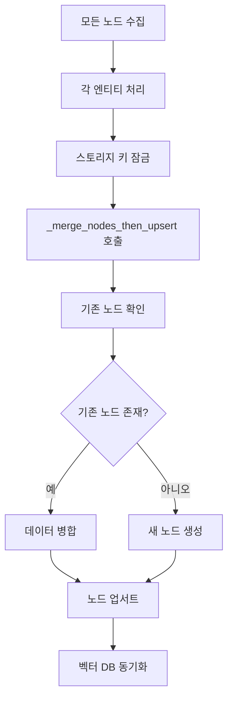
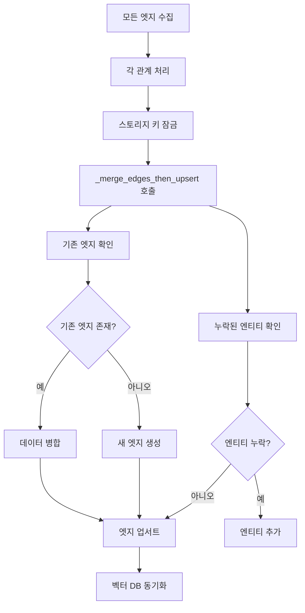
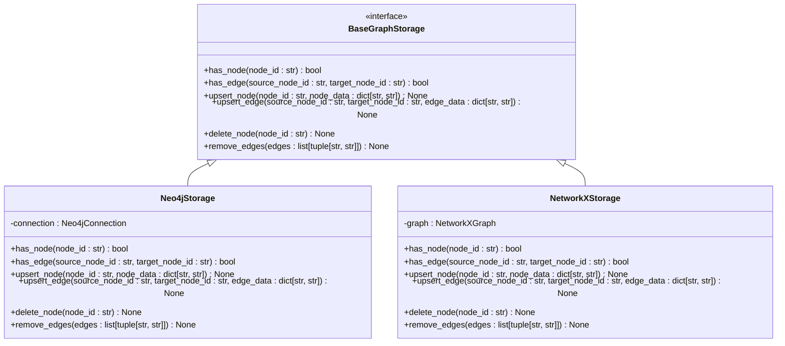
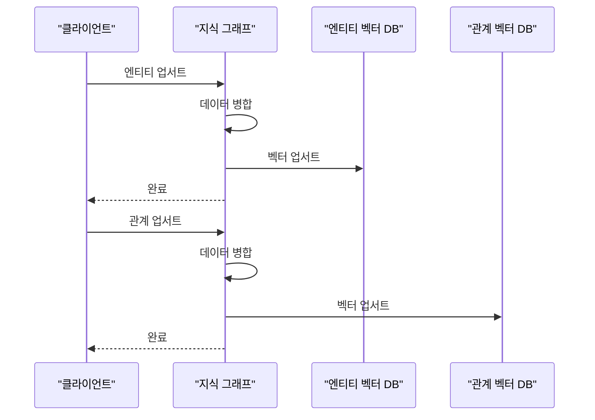
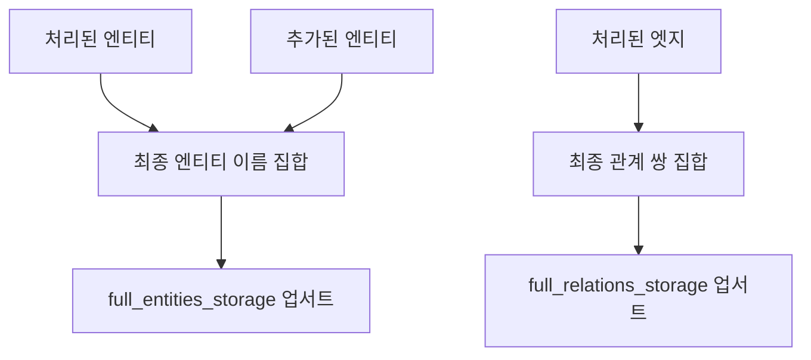

# 그래프 병합 및 저장

<cite>
**이 문서에서 참조한 파일**
- [operate.py](file://lightrag/operate.py#L1386-L1671)
- [base.py](file://lightrag/base.py#L304-L341)
- [base.py](file://lightrag/base.py#L345-L668)
- [operate.py](file://lightrag/operate.py#L1125-L1214)
- [operate.py](file://lightrag/operate.py#L1217-L1383)
</cite>

## 목차
1. [개요](#개요)
2. [엔티티 및 관계 병합 프로세스](#엔티티-및-관계-병합-프로세스)
3. [그래프 일관성 유지 메커니즘](#그래프-일관성-유지-메커니즘)
4. [데이터 흐름 및 최종 저장소](#데이터-흐름-및-최종-저장소)

## 개요

이 문서는 LightRAG 시스템에서 엔티티와 관계를 지식 그래프에 병합하고 저장하는 과정을 설명합니다. 주요 초점은 `merge_nodes_and_edges` 함수가 청크별 추출 결과를 통합하는 두 단계 프로세스(엔티티 우선 처리, 관계 후속 처리)와 그래프 일관성을 유지하는 방법입니다. 또한 다양한 그래프 백엔드(Neo4j, NetworkX 등)를 추상화하는 `BaseGraphStorage` 인터페이스와, `entity_vdb` 및 `relationships_vdb`를 통한 벡터 저장소 동기화, 그리고 `full_entities` 및 `full_relations` 저장소에 최종 결과를 저장하는 데이터 흐름을 다룹니다.

**Section sources**
- [operate.py](file://lightrag/operate.py#L1386-L1671)

## 엔티티 및 관계 병합 프로세스

`merge_nodes_and_edges` 함수는 청크별 추출 결과를 통합하기 위해 세 단계의 프로세스를 따릅니다. 이 접근 방식은 데이터 일관성을 보장합니다.

### 1단계: 엔티티 병합 및 업서트

첫 번째 단계에서는 모든 엔티티를 동시에 처리합니다. `all_nodes` 딕셔너리에 모든 노드를 수집한 후, `_locked_process_entity_name` 내부 함수를 사용하여 각 엔티티를 처리합니다. 이 함수는 `get_storage_keyed_lock`을 사용하여 동시성 문제를 방지하고, `_merge_nodes_then_upsert` 함수를 호출하여 기존 노드가 있는지 확인하고, 존재하면 데이터를 병합하거나 새로운 노드를 생성합니다.

**Diagram sources**
- [operate.py](file://lightrag/operate.py#L1386-L1671)
- [operate.py](file://lightrag/operate.py#L1125-L1214)

**Section sources**
- [operate.py](file://lightrag/operate.py#L1386-L1671)
- [operate.py](file://lightrag/operate.py#L1125-L1214)

### 2단계: 관계 병합 및 업서트

두 번째 단계에서는 모든 관계를 동시에 처리합니다. `all_edges` 딕셔너리에 모든 엣지를 수집한 후, `_locked_process_edges` 내부 함수를 사용하여 각 관계를 처리합니다. 이 함수는 `_merge_edges_then_upsert` 함수를 호출하여 기존 엣지가 있는지 확인하고, 존재하면 데이터를 병합하거나 새로운 엣지를 생성합니다. 이 과정에서 엔티티가 누락된 경우 자동으로 추가됩니다.

**Diagram sources**
- [operate.py](file://lightrag/operate.py#L1386-L1671)
- [operate.py](file://lightrag/operate.py#L1217-L1383)

**Section sources**
- [operate.py](file://lightrag/operate.py#L1386-L1671)
- [operate.py](file://lightrag/operate.py#L1217-L1383)

## 그래프 일관성 유지 메커니즘

### BaseGraphStorage 인터페이스를 통한 백엔드 추상화

`BaseGraphStorage` 인터페이스는 다양한 그래프 백엔드(Neo4j, NetworkX 등)를 추상화하여, 시스템이 특정 백엔드에 종속되지 않도록 합니다. 이 인터페이스는 노드와 엣지의 존재 여부 확인, 업서트, 삭제 등의 기본적인 그래프 연산을 정의합니다.

**Diagram sources**
- [base.py](file://lightrag/base.py#L345-L668)

**Section sources**
- [base.py](file://lightrag/base.py#L345-L668)

### 벡터 저장소 동기화

`entity_vdb` 및 `relationships_vdb`는 엔티티와 관계의 벡터 표현을 저장하는 데 사용됩니다. 엔티티와 관계가 그래프에 업서트될 때마다, 이 벡터 저장소도 동기화됩니다. 이는 빠른 검색과 유사도 기반 쿼리를 가능하게 합니다.

**Section sources**
- [operate.py](file://lightrag/operate.py#L1386-L1671)

## 데이터 흐름 및 최종 저장소

### 3단계: 최종 결과 저장

세 번째 단계에서는 `full_entities_storage` 및 `full_relations_storage`에 최종 결과를 저장합니다. 이 저장소는 문서별 엔티티 및 관계 목록을 유지하여, 문서의 전체적인 지식 구조를 파악할 수 있게 합니다.

**Diagram sources**
- [operate.py](file://lightrag/operate.py#L1386-L1671)

**Section sources**
- [operate.py](file://lightrag/operate.py#L1386-L1671)