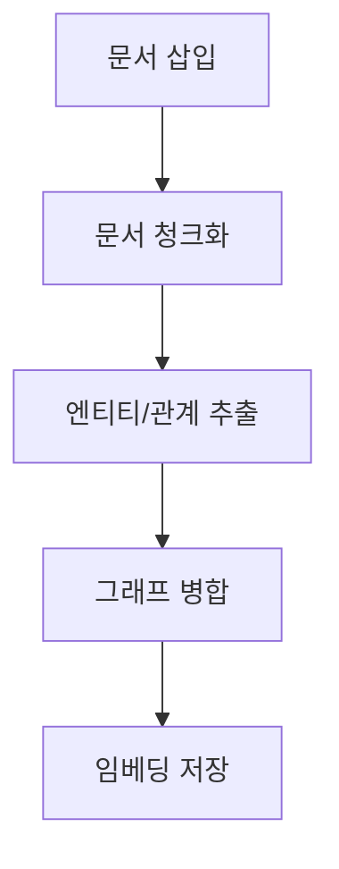

# 문서 처리 파이프라인

<cite>
**이 문서에서 참조된 파일**   
- [lightrag.py](file://lightrag/lightrag.py)
- [operate.py](file://lightrag/operate.py)
- [utils.py](file://lightrag/utils.py)
</cite>

## 목차
1. [소개](#소개)
2. [주요 매개변수](#주요-매개변수)
3. [파이프라인 단계별 분석](#파이프라인-단계별-분석)
4. [비동기 처리 및 오류 처리](#비동기-처리-및-오류-처리)
5. [토크나이저 및 유틸리티 통합](#토크나이저-및-유틸리티-통합)

## 소개
LightRAG 시스템의 문서 처리 파이프라인은 문서 삽입부터 벡터 저장소에 임베딩 저장까지의 일련의 과정을 포함합니다. 이 문서는 `insert` 메서드를 시작으로 문서 청크화, 엔티티/관계 추출, 그래프 병합, 임베딩 저장까지의 전체 흐름을 단계별로 설명합니다.

**Section sources**
- [lightrag.py](file://lightrag/lightrag.py#L881-L914)

## 주요 매개변수
문서 처리 파이프라인에서 사용되는 주요 매개변수는 다음과 같습니다:

- **top_k**: 각 쿼리에 대해 검색할 엔티티/관계의 수
- **chunk_token_size**: 문서를 청크화할 때 최대 토큰 수
- **kg_chunk_pick_method**: 텍스트 청크 선택 방법 ('WEIGHT' 또는 'VECTOR')
- **max_parallel_insert**: 문서 인덱싱 파이프라인에서 동시에 처리할 수 있는 문서 수

이러한 매개변수들은 파이프라인의 성능과 정확도에 중요한 영향을 미칩니다.

**Section sources**
- [lightrag.py](file://lightrag/lightrag.py#L182-L182)

## 파이프라인 단계별 분석
문서 처리 파이프라인은 다음과 같은 단계로 구성됩니다:

1. **문서 삽입**: `insert` 메서드를 통해 문서가 삽입됩니다.
2. **문서 청크화**: `chunking_by_token_size` 함수를 통해 문서가 청크 단위로 분할됩니다.
3. **엔티티/관계 추출**: `extract_entities` 함수를 통해 청크에서 엔티티와 관계가 추출됩니다.
4. **그래프 병합**: `merge_nodes_and_edges` 함수를 통해 추출된 노드와 엣지가 그래프에 병합됩니다.
5. **임베딩 저장**: 벡터 저장소에 임베딩이 저장됩니다.

각 단계는 파이프라인의 핵심 구성 요소로, 문서의 구조화된 정보를 추출하고 저장하는 데 중요한 역할을 합니다.

**Diagram sources**
- [lightrag.py](file://lightrag/lightrag.py#L881-L914)
- [operate.py](file://lightrag/operate.py#L63-L115)

## 비동기 처리 및 오류 처리
LightRAG 시스템은 비동기 처리를 통해 문서 처리 파이프라인의 효율성을 높입니다. `ainsert` 메서드는 비동기적으로 문서를 삽입하며, `apipeline_enqueue_documents`와 `apipeline_process_enqueue_documents` 함수를 통해 문서 처리를 백그라운드에서 수행합니다.

오류 처리는 각 단계에서 예외를 적절히 처리하고 로깅함으로써 이루어집니다. 예를 들어, 문서 처리 중 오류가 발생하면 `doc_status`에 실패 상태가 기록되며, 관련 정보가 로깅됩니다.

**Section sources**
- [lightrag.py](file://lightrag/lightrag.py#L881-L914)

## 토크나이저 및 유틸리티 통합
`utils.py`의 `Tokenizer` 인터페이스는 문서 처리 파이프라인에 통합되어 토큰화를 수행합니다. `truncate_list_by_token_size` 함수는 토큰 크기에 따라 목록을 자르는 데 사용되며, 이는 문서 청크화 과정에서 중요한 역할을 합니다.

이러한 유틸리티 함수들은 파이프라인의 각 단계에서 일관된 방식으로 토큰화와 데이터 처리를 보장합니다.

**Section sources**
- [utils.py](file://lightrag/utils.py#L157-L157)