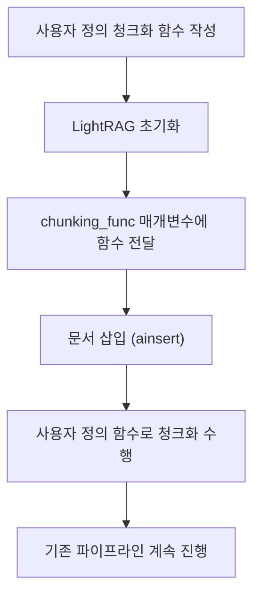

# 문서 청크화

<cite>
**이 문서에서 참조한 파일**  
- [operate.py](file://lightrag/operate.py)
- [utils.py](file://lightrag/utils.py)
- [lightrag.py](file://lightrag/lightrag.py)
</cite>

## 목차
1. [소개](#소개)
2. [청크화 프로세스 개요](#청크화-프로세스-개요)
3. [chunking_by_token_size 함수 분석](#chunking_by_token_size-함수-분석)
4. [Tokenizer 인터페이스와 모델 간 토큰화](#tokenizer-인터페이스와-모델-간-토큰화)
5. [컨텍스트 길이 제어: truncate_list_by_token_size](#컨텍스트-길이-제어-truncate_list_by_token_size)
6. [사용자 정의 청크화 함수 확장 메커니즘](#사용자-정의-청크화-함수-확장-메커니즘)
7. [결론](#결론)

## 소개
문서 청크화는 대규모 언어 모델(LLM) 기반 정보 검색 및 생성 시스템에서 핵심적인 전처리 단계입니다. 이 문서는 LightRAG 프레임워크 내에서 문서를 토큰 크기 기반으로 청크로 분할하는 `chunking_by_token_size` 함수의 작동 방식을 상세히 설명합니다. 특히 `chunk_token_size` 및 `chunk_overlap_token_size` 매개변수의 역할과 영향을 다루며, 다양한 LLM(gpt-4o-mini 등)에 따라 토큰화를 처리하는 `Tokenizer` 인터페이스의 구조와 `truncate_list_by_token_size` 함수가 컨텍스트 길이를 제어하는 메커니즘을 분석합니다. 또한, 사용자 정의 청크화 함수를 `chunking_func`에 주입하는 확장 메커니즘을 코드 예제를 통해 설명합니다.

## 청크화 프로세스 개요
문서 청크화는 긴 텍스트를 더 작은 단위로 나누는 과정으로, LLM의 컨텍스트 창 제한을 초과하지 않도록 하며, 의미 있는 정보 단위를 유지하는 데 중요합니다. LightRAG에서는 이 과정을 `chunking_by_token_size` 함수를 통해 수행하며, 이 함수는 텍스트를 토큰 단위로 분할하여 청크를 생성합니다. 이 과정은 문서 삽입(insert) 시점에서 발생하며, 이후의 엔티티 추출, 관계 맵핑, 검색 쿼리 처리 등 모든 후속 작업의 기반이 됩니다. 청크화는 단순한 문자 기반 분할이 아닌, 토큰화를 기반으로 하여 모델의 실제 입력 길이를 정확하게 제어할 수 있도록 설계되었습니다.

## chunking_by_token_size 함수 분석
`chunking_by_token_size` 함수는 문서 내용을 토큰 크기 기반으로 청크로 분할하는 핵심 함수입니다. 이 함수는 `Tokenizer` 인스턴스, 분할할 `content`, 그리고 분할 옵션을 매개변수로 받습니다. 주요 매개변수는 `max_token_size`(청크당 최대 토큰 수)와 `overlap_token_size`(청크 간 중복 토큰 수)입니다. 함수는 먼저 전체 콘텐츠를 토큰화한 후, `max_token_size - overlap_token_size` 만큼의 간격으로 슬라이딩 윈도우를 적용하여 청크를 생성합니다. 이는 각 청크가 이전 청크의 끝부분과 일부 중복되도록 하여 문맥의 연속성을 유지합니다. 생성된 각 청크는 토큰 수, 내용, 청크 순서 인덱스를 포함하는 딕셔너리로 반환되며, 이는 후속 처리를 위한 구조화된 데이터를 제공합니다.

**Section sources**
- [operate.py](file://lightrag/operate.py#L63-L115)

## Tokenizer 인터페이스와 모델 간 토큰화
`Tokenizer` 인터페이스는 다양한 LLM에 대한 토큰화를 추상화하여 일관된 인터페이스를 제공합니다. 이 인터페이스는 `encode`(문자열을 토큰 ID 리스트로 변환)와 `decode`(토큰 ID 리스트를 문자열로 복원)라는 두 가지 핵심 메서드를 정의합니다. `TiktokenTokenizer` 클래스는 이 인터페이스를 구현하며, `gpt-4o-mini`와 같은 OpenAI 모델에 사용되는 tiktoken 라이브러리를 래핑합니다. 이를 통해 LightRAG는 `gpt-4o-mini` 외에도 다른 tiktoken이 지원하는 모델에 대해 동일한 청크화 로직을 사용할 수 있습니다. `Tokenizer` 래퍼 클래스는 모델 이름과 실제 토크나이저 인스턴스를 캡슐화하여, `chunking_by_token_size`와 같은 함수가 구체적인 토크나이저 구현에 의존하지 않고도 토큰화 작업을 수행할 수 있도록 합니다.

**Section sources**
- [utils.py](file://lightrag/utils.py#L636-L688)

## 컨텍스트 길이 제어: truncate_list_by_token_size
`truncate_list_by_token_size` 함수는 검색된 청크 목록의 총 토큰 수를 제어하여 LLM의 컨텍스트 창을 초과하지 않도록 보장합니다. 이 함수는 청크 목록(`list_data`)과 각 항목에서 토큰화할 텍스트를 추출하는 `key` 함수, 최대 허용 토큰 수(`max_token_size`), 그리고 `Tokenizer` 인스턴스를 입력으로 받습니다. 함수는 목록의 항목을 순회하면서 누적 토큰 수를 계산하고, `max_token_size`를 초과하는 즉시 그 지점에서 목록을 잘라냅니다. 이는 검색 후처리 단계에서, 특히 `process_chunks_unified` 함수 내에서 사용되어, 최종적으로 LLM에 전달되는 컨텍스트의 길이를 엄격하게 제어합니다. 이 메커니즘은 시스템의 안정성과 예측 가능성을 보장합니다.

**Section sources**
- [utils.py](file://lightrag/utils.py#L754-L768)

## 사용자 정의 청크화 함수 확장 메커니즘
LightRAG은 `chunking_func` 매개변수를 통해 사용자 정의 청크화 함수를 주입할 수 있는 유연한 확장 메커니즘을 제공합니다. `LightRAG` 클래스의 생성자에서 `chunking_func`는 기본값으로 `chunking_by_token_size` 함수를 사용하지만, 사용자는 이 매개변수에 자신만의 청크화 로직을 구현한 함수를 전달할 수 있습니다. 이 함수는 `chunking_by_token_size`와 동일한 시그니처(매개변수와 반환 타입)를 따라야 합니다. 예를 들어, 특정 도메인의 문서를 처리하기 위해 문장 경계를 우선시하는 청크화 함수나, 특정 마크다운 구조를 인식하는 함수를 개발하여 주입할 수 있습니다. 이는 LightRAG의 핵심 기능을 변경하지 않고도, 다양한 문서 유형과 사용 사례에 맞게 전처리 파이프라인을 맞춤화할 수 있게 해줍니다.

**Diagram sources**
- [lightrag.py](file://lightrag/lightrag.py#L222)
- [lightrag.py](file://lightrag/lightrag.py#L1496-L1522)

## 결론
이 문서는 LightRAG의 문서 청크화 메커니즘을 심층적으로 분석하였습니다. `chunking_by_token_size` 함수는 토큰 기반 슬라이딩 윈도우를 사용하여 일관되고 정확한 청크화를 수행하며, `chunk_overlap_token_size` 매개변수를 통해 문맥의 연속성을 유지합니다. `Tokenizer` 인터페이스는 다양한 LLM과의 호환성을 보장하며, `truncate_list_by_token_size` 함수는 컨텍스트 길이를 엄격하게 제어하여 시스템의 안정성을 확보합니다. 무엇보다도, `chunking_func` 매개변수를 통한 확장 메커니즘은 LightRAG의 핵심적인 유연성을 제공하여, 사용자가 특정 요구사항에 맞게 전처리 과정을 맞춤화할 수 있도록 합니다. 이러한 설계는 LightRAG가 다양한 문서 유형과 복잡한 사용 사례에 효과적으로 적용될 수 있도록 합니다.