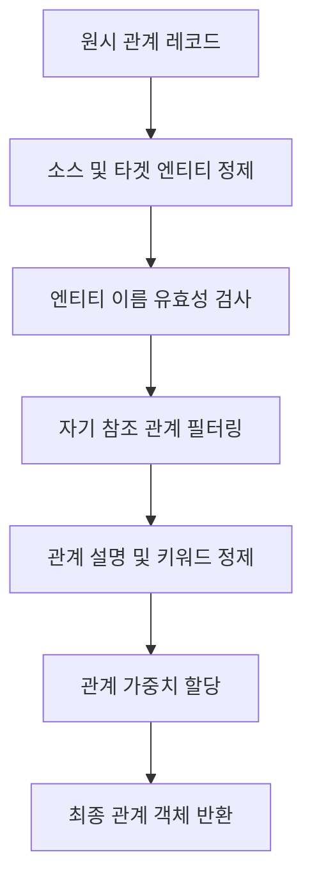

# 관계 추출

<cite>
**이 문서에서 참조된 파일**   
- [operate.py](file://lightrag/operate.py)
- [prompt.py](file://lightrag/prompt.py)
- [utils.py](file://lightrag/utils.py)
</cite>

## 목차
1. [소개](#소개)
2. [관계 추출 메커니즘 개요](#관계-추출-메커니즘-개요)
3. [관계 추출 프롬프트 템플릿 분석](#관계-추출-프롬프트-템플릿-분석)
4. [단일 관계 추출 내부 로직](#단일-관계-추출-내부-로직)
5. [관계 데이터 정제 함수 분석](#관계-데이터-정제-함수-분석)
6. [오류 처리 및 로깅 전략](#오류-처리-및-로깅-전략)

## 소개
이 문서는 LightRAG 시스템의 관계 추출 메커니즘을 심층적으로 분석합니다. 관계 추출은 텍스트에서 식별된 엔티티 간의 의미적 연결을 추출하는 핵심 과정으로, 지식 그래프의 구조적 완전성과 의미적 풍부함을 결정합니다. 본 문서는 `operate.py`의 `extract_entities` 함수가 관계 추출을 수행하는 방식, `prompt.py`의 `entity_extraction` 프롬프트 템플릿이 관계 정보를 어떻게 구조화하는지, `_handle_single_relationship_extraction` 함수의 내부 로직, 그리고 `sanitize_text_for_encoding`, `clean_str`, `normalize_extracted_info` 함수들이 관계 데이터 정제에 기여하는 방식을 상세히 설명합니다. 또한, 자기 참조 관계 필터링, 오류 처리 및 로깅 전략도 포함합니다.

## 관계 추출 메커니즘 개요
관계 추출 프로세스는 `extract_entities` 함수를 중심으로 이루어집니다. 이 함수는 문서 청크를 입력으로 받아, 언어 모델(LLM)을 활용하여 엔티티와 관계를 추출합니다. 프로세스는 다음과 같은 주요 단계로 구성됩니다.

1.  **프롬프트 생성**: `prompt.py`에 정의된 `entity_extraction` 템플릿을 사용하여 LLM에 전달할 프롬프트를 생성합니다. 이 프롬프트는 추출할 엔티티 유형, 언어, 예제 등을 포함합니다.
2.  **LLM 호출**: 생성된 프롬프트를 LLM에 전달하여 초기 추출 결과를 얻습니다.
3.  **결과 파싱**: LLM의 출력을 파싱하여 엔티티와 관계를 구조화된 데이터로 변환합니다. 이 과정에서 `_handle_single_entity_extraction`과 `_handle_single_relationship_extraction` 함수가 각각 엔티티와 관계 레코드를 처리합니다.
4.  **추출 간소화(Gleaning)**: 초기 추출에서 누락된 항목을 보완하기 위해, LLM에 추가적인 추출을 요청하는 반복적인 과정을 수행합니다.
5.  **데이터 정제 및 유효성 검사**: 추출된 관계 데이터는 다양한 함수를 통해 정제되며, 소스 및 타겟 엔티티의 유효성과 자기 참조 관계 여부가 검사됩니다.
6.  **캐싱**: 추출 결과는 캐시에 저장되어 동일한 입력에 대한 반복적인 LLM 호출을 방지합니다.

이러한 일련의 과정을 통해 텍스트에서 구조화된 관계 정보를 추출하고, 이를 지식 그래프에 저장합니다.

**Section sources**
- [operate.py](file://lightrag/operate.py#L1674-L1914)

## 관계 추출 프롬프트 템플릿 분석
관계 추출의 핵심은 `prompt.py` 파일에 정의된 `PROMPTS["entity_extraction"]` 템플릿에 있습니다. 이 템플릿은 LLM에게 관계를 추출하도록 지시하는 구조화된 프롬프트를 제공합니다.

```mermaid
flowchart TD
A[사용자 입력 텍스트] --> B[entity_extraction 프롬프트 템플릿]
B --> C[LLM 호출]
C --> D[구조화된 출력]
D --> E[("relationship"<|>source<|>target<|>description<|>keywords<|>strength>)##(...)]
```

**Diagram sources**
- [prompt.py](file://lightrag/prompt.py#L20-L140)

### 프롬프트 구조
프롬프트 템플릿은 다음과 같은 명확한 구조를 따릅니다.

1.  **목표(Goal)**: 주어진 텍스트에서 엔티티와 그들 사이의 관계를 식별하라는 명확한 지시를 제공합니다.
2.  **단계(Steps)**:
    *   **엔티티 식별**: 엔티티 이름, 유형, 설명을 추출합니다.
    *   **관계 식별**: 명확하게 관련된 엔티티 쌍을 식별합니다.
    *   **관계 정보 추출**: 다음 정보를 추출합니다.
        *   `source_entity`: 소스 엔티티 이름.
        *   `target_entity`: 타겟 엔티티 이름.
        *   `relationship_description`: 두 엔티티가 관련된 이유에 대한 설명.
        *   `relationship_strength`: 관계의 강도를 나타내는 숫자 점수.
        *   `relationship_keywords`: 관계의 핵심 개념이나 주제를 요약하는 고수준 키워드.
3.  **출력 형식**: 관계는 `("relationship"{tuple_delimiter}<source_entity>{tuple_delimiter}<target_entity>{tuple_delimiter}<relationship_description>{tuple_delimiter}<relationship_keywords>{tuple_delimiter}<relationship_strength>)` 형식으로 출력되어야 합니다. 여기서 `{tuple_delimiter}`은 `<|>`로 대체됩니다.
4.  **리스트 구분자**: 모든 엔티티와 관계는 `{record_delimiter}` (##)로 구분된 단일 리스트로 반환됩니다.
5.  **완료 표시자**: 추출이 완료되면 `{completion_delimiter}` (`<|COMPLETE|>`)를 출력합니다.

### 예제의 역할
프롬프트는 `PROMPTS["entity_extraction_examples"]`에 정의된 예제를 포함합니다. 이러한 예제는 LLM에게 원하는 출력 형식과 내용의 깊이를 보여주는 중요한 역할을 합니다. 예제는 다양한 도메인(예: 인물, 기술, 금융)에서 관계를 어떻게 추출하고 구조화해야 하는지를 보여주며, LLM의 출력 일관성을 높입니다.

**Section sources**
- [prompt.py](file://lightrag/prompt.py#L20-L140)

## 단일 관계 추출 내부 로직
`_handle_single_relationship_extraction` 함수는 파싱된 관계 레코드를 받아, 유효성 검사, 데이터 정제, 가중치 할당을 수행하여 최종적인 관계 객체를 생성하는 핵심 함수입니다.



**Diagram sources**
- [operate.py](file://lightrag/operate.py#L378-L456)

### 소스 및 타겟 엔티티의 유효성 검사
함수는 먼저 입력 레코드의 유효성을 검사합니다.
```python
if len(record_attributes) < 5 or '"relationship"' not in record_attributes[0]:
    return None
```
레코드가 최소 5개의 속성(관계 태그, 소스, 타겟, 설명, 키워드)을 가져야 하며, 첫 번째 속성에 `"relationship"` 문자열이 포함되어야 합니다. 이 조건을 충족하지 않으면 `None`을 반환하여 무시합니다.

### 관계 설명 및 키워드 추출
소스 및 타겟 엔티티는 다음과 같은 세 단계의 엄격한 정제 파이프라인을 거칩니다.
1.  **UTF-8 인코딩 정제**: `sanitize_text_for_encoding` 함수를 사용하여 인코딩 오류를 유발할 수 있는 문제 있는 유니코드 문자(예: 서러게이트 쌍)를 제거하거나 대체합니다.
2.  **HTML 및 제어 문자 정리**: `clean_str` 함수를 사용하여 HTML 엔티티를 디코딩하고, 제어 문자를 제거합니다.
3.  **비즈니스 로직 정규화**: `normalize_extracted_info` 함수를 사용하여 중국어 문자 간의 공백 제거, 중국어 대괄호를 영문 대괄호로 교체 등의 정규화를 수행합니다.

관계 설명과 키워드도 동일한 정제 파이프라인을 따릅니다. 특히 키워드는 중국어 쉼표(，)를 영문 쉼표(,)로 교체하여 일관성을 유지합니다.
```python
edge_keywords = edge_keywords.replace("，", ",")
```

### 관계 가중치 할당 방식
관계의 가중치(`weight`)는 프롬프트 출력의 마지막 속성에서 추출됩니다. 이 값은 관계의 강도를 나타내는 숫자 점수입니다.
```python
weight = (
    float(record_attributes[-1].strip('"').strip("'"))
    if is_float_regex(record_attributes[-1].strip('"').strip("'"))
    else 1.0
)
```
*   함수는 마지막 속성에서 따옴표를 제거한 후, `is_float_regex` 함수를 사용하여 유효한 부동소수점 숫자인지 확인합니다.
*   유효한 숫자라면 `float`로 변환하여 가중치로 사용합니다.
*   유효하지 않은 경우 기본값으로 `1.0`을 할당합니다.

### 자기 참조 관계 필터링
소스 엔티티와 타겟 엔티티가 동일한 경우(자기 참조 관계), 이는 일반적으로 의미 없는 정보로 간주되며 필터링됩니다.
```python
if source == target:
    logger.debug(f"Relationship source and target are the same in: {record_attributes}")
    return None
```
이 로직은 지식 그래프의 노이즈를 줄이고, 의미 있는 관계만 유지하는 데 중요합니다.

**Section sources**
- [operate.py](file://lightrag/operate.py#L378-L456)

## 관계 데이터 정제 함수 분석
관계 데이터의 품질을 보장하기 위해 `utils.py`에 정의된 여러 정제 함수가 사용됩니다. 이들 함수는 관계 추출 파이프라인의 전반에 걸쳐 사용됩니다.

### sanitize_text_for_encoding
이 함수는 텍스트 인코딩 오류를 방지하는 첫 번째 방어선입니다.
*   **목적**: UTF-8 인코딩 중 오류를 유