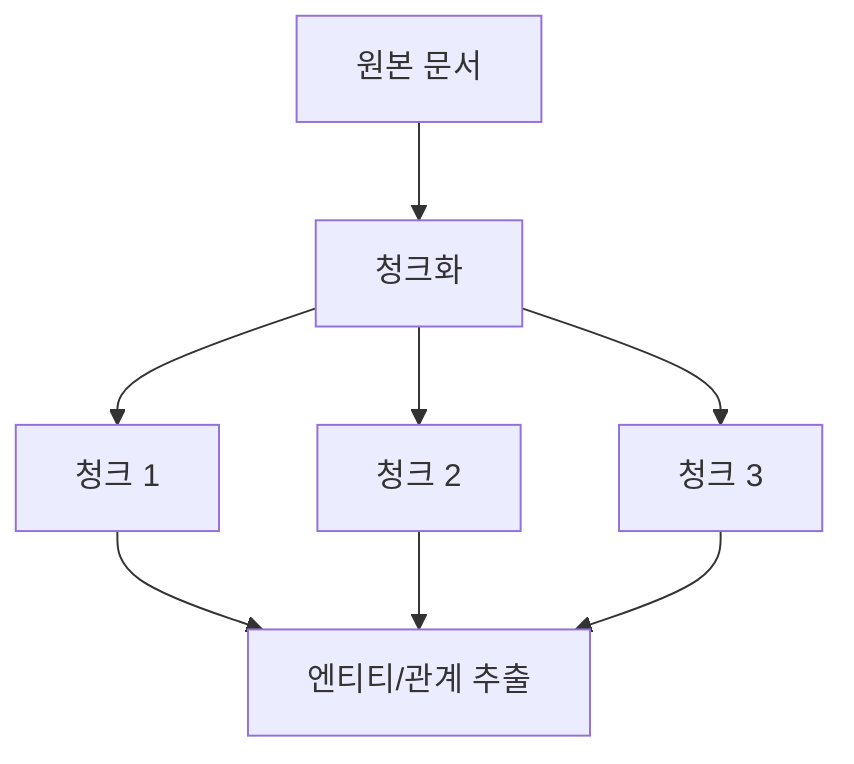
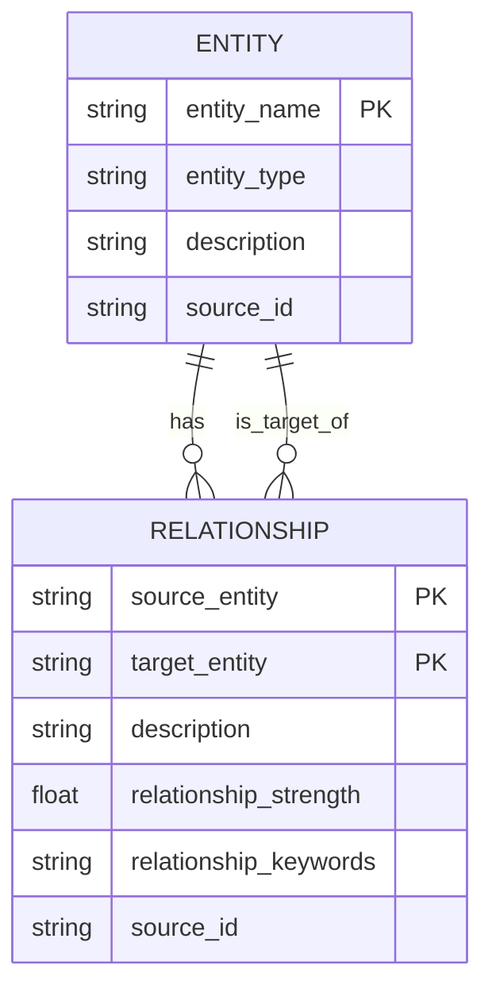
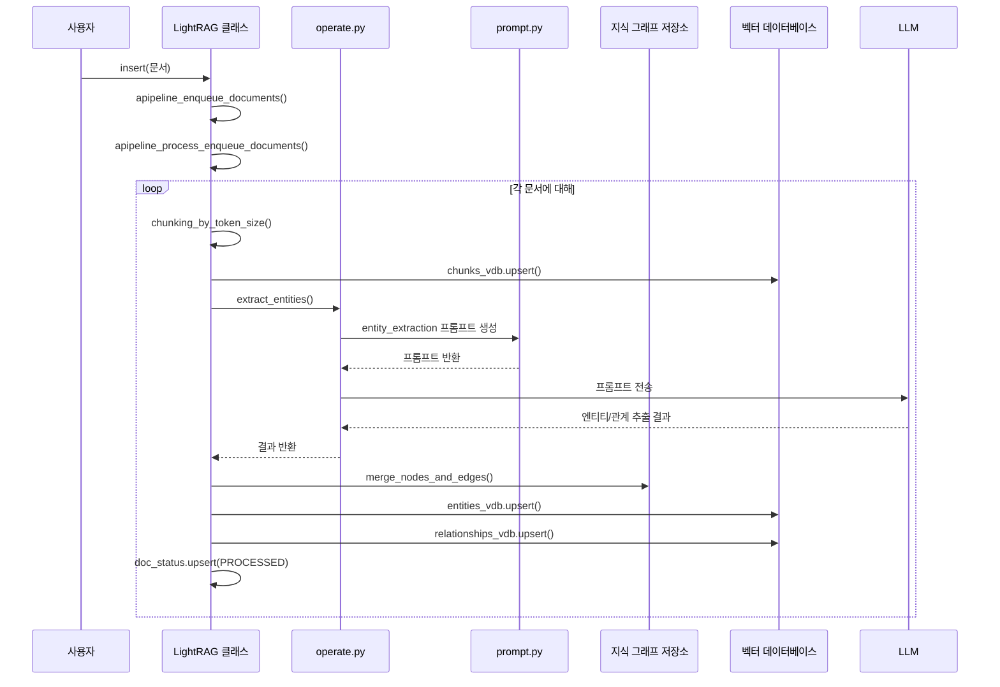

# 지식 그래프 기반 RAG

<cite>
**이 문서에서 참조한 파일**   
- [operate.py](file://lightrag/operate.py)
- [prompt.py](file://lightrag/prompt.py)
- [constants.py](file://lightrag/constants.py)
- [lightrag.py](file://lightrag/lightrag.py)
</cite>

## 목차
1. [소개](#소개)
2. [문서 처리 파이프라인](#문서-처리-파이프라인)
3. [LightRAG 클래스의 지식 그래프 생성](#lightrag-클래스의-지식-그래프-생성)
4. [엔티티 추출의 재시도 메커니즘](#엔티티-추출의-재시도-메커니즘)
5. [결론](#결론)

## 소개
지식 그래프 기반 검색 증강 생성(RAG)은 전통적인 RAG의 한계를 극복하고, 문서 내 복잡한 의미적 관계를 모델링하여 보다 정확하고 맥락에 부합하는 답변을 생성하는 고급 기술입니다. LightRAG는 이 개념을 구현한 경량화된 시스템으로, 사용자가 제공한 문서를 분석하여 지식 그래프를 동적으로 생성하고, 이를 기반으로 질의에 응답합니다. 이 문서는 LightRAG의 핵심 작동 원리를 심층적으로 분석하며, 문서 처리 파이프라인의 각 단계와 그 내부 구현을 설명합니다.

## 문서 처리 파이프라인
LightRAG의 핵심은 문서를 단순한 텍스트 덩어리가 아닌, 상호 연결된 의미적 구조로 변환하는 파이프라인에 있습니다. 이 파이프라인은 다음과 같은 네 가지 주요 단계로 구성됩니다: **청크화 → 엔티티/관계 추출 → 지식 그래프 생성 → 벡터 임베딩**. 각 단계는 다음 단계의 입력을 제공하며, 최종적으로 질의에 응답할 수 있는 풍부한 지식 기반을 구축합니다.

### 청크화
문서 처리의 첫 번째 단계는 대용량의 원본 문서를 더 작은 단위로 분할하는 것입니다. 이 과정을 '청크화(chunking)'라고 합니다. `lightrag.py` 파일의 `LightRAG` 클래스는 `chunking_by_token_size` 함수를 기본 청크화 함수로 사용합니다. 이 함수는 문서를 토큰(token) 단위로 분할하며, 각 청크의 크기를 `chunk_token_size` 매개변수(기본값 1200 토큰)로 제어합니다. 또한, 인접한 청크 간에 `chunk_overlap_token_size` 매개변수(기본값 100 토큰)만큼의 중복을 두어, 문장이나 의미가 청크의 경계에서 끊기는 것을 방지하여 맥락의 연속성을 유지합니다. 이는 후속 단계에서 엔티티와 관계를 보다 정확하게 추출하는 데 필수적입니다.

**Diagram sources**
- [lightrag.py](file://lightrag/lightrag.py#L140-L145)
- [operate.py](file://lightrag/operate.py#L0-L100)

**Section sources**
- [lightrag.py](file://lightrag/lightrag.py#L130-L150)
- [operate.py](file://lightrag/operate.py#L0-L100)

### 엔티티/관계 추출
청크화된 각 텍스트 조각은 대규모 언어 모델(LLM)에 의해 분석되어, 그 안에 포함된 의미적 요소가 추출됩니다. 이 과정은 `operate.py` 파일의 `extract_entities` 함수에 의해 수행되며, 두 가지 핵심 작업을 수행합니다.

첫째, **엔티티 추출**입니다. LLM은 텍스트에서 사람, 조직, 장소, 사건 등과 같은 실체(entity)를 식별합니다. 각 엔티티에 대해 이름(`entity_name`)과 유형(`entity_type`)을 추출하며, 특히 중요한 것은 엔티티에 대한 포괄적인 설명(`entity_description`)을 생성하는 것입니다. 이 설명은 원본 텍스트에 명시된 정보에 기반해야 하며, 모델이 정보를 추론하거나 허구를 생성해서는 안 됩니다.

둘째, **관계 추출**입니다. LLM은 추출된 엔티티들 사이의 의미적 관계를 파악합니다. 예를 들어, "A는 B의 CEO이다"라는 문장에서 A와 B 사이에 "직위"라는 관계가 형성됩니다. 각 관계는 출처 엔티티(`source_entity`), 대상 엔티티(`target_entity`), 관계 설명(`relationship_description`), 관계 강도(`relationship_strength`), 그리고 관계의 핵심 개념을 요약하는 키워드(`relationship_keywords`)로 구성됩니다.

이러한 추출 작업은 `prompt.py` 파일에 정의된 `entity_extraction` 프롬프트 템플릿을 통해 LLM에 지시됩니다. 이 템플릿은 추출 과정을 명확한 단계로 구조화하여, 모델이 일관되고 체계적인 출력을 생성하도록 유도합니다.

**Section sources**
- [operate.py](file://lightrag/operate.py#L1000-L1500)
- [prompt.py](file://lightrag/prompt.py#L20-L120)

### 지식 그래프 생성
추출된 엔티티와 관계는 단순한 데이터베이스에 저장되는 것이 아니라, 노드(엔티티)와 엣지(관계)로 구성된 **지식 그래프**로 통합됩니다. `lightrag.py` 파일의 `LightRAG` 클래스는 `chunk_entity_relation_graph`라는 `BaseGraphStorage` 인스턴스를 통해 이 그래프를 관리합니다. `extract_entities` 함수의 출력은 `merge_nodes_and_edges` 함수를 통해 이 그래프 저장소에 병합됩니다.

이 과정에서 중요한 점은 중복 처리입니다. 동일한 엔티티가 여러 청크에서 추출될 수 있으므로, 시스템은 기존 그래프에 존재하는 엔티티와 새로운 추출 결과를 병합하여, 하나의 통합된 엔티티 노드를 유지합니다. 관계도 마찬가지로 병합되며, 다양한 출처에서 수집된 정보가 하나의 관계 엣지에 집약됩니다. 이렇게 생성된 지식 그래프는 문서의 의미적 구조를 시각화하고, 질의 시 관련 엔티티와 관계를 효율적으로 탐색할 수 있는 기반을 제공합니다.

**Diagram sources**
- [lightrag.py](file://lightrag/lightrag.py#L800-L900)
- [operate.py](file://lightrag/operate.py#L2000-L2100)

**Section sources**
- [lightrag.py](file://lightrag/lightrag.py#L800-L900)
- [operate.py](file://lightrag/operate.py#L2000-L2100)

### 벡터 임베딩
지식 그래프는 엔티티와 관계의 구조적 연결을 나타내지만, 질의와의 의미적 유사도를 측정하기 위해서는 **벡터 임베딩**이 필요합니다. `lightrag.py` 파일은 `entities_vdb`, `relationships_vdb`, `chunks_vdb`라는 세 개의 `BaseVectorStorage` 인스턴스를 통해 벡터 데이터베이스를 관리합니다.

- **엔티티 벡터 DB**: 각 엔티티의 이름과 설명을 결합한 텍스트를 임베딩하여 저장합니다.
- **관계 벡터 DB**: 관계의 키워드, 출처 엔티티, 대상 엔티티, 설명 등을 결합한 텍스트를 임베딩하여 저장합니다.
- **청크 벡터 DB**: 원본 청크화된 텍스트를 그대로 임베딩하여 저장합니다.

이러한 벡터화는 `embedding_func`에 의해 수행되며, 사용자는 `BAAI/bge-m3` 또는 `text-embedding-3-large`와 같은 고품질 임베딩 모델을 선택할 수 있습니다. 질의 시, 사용자의 질문도 동일한 임베딩 모델을 사용하여 벡터로 변환되고, 이 벡터와 벡터 DB 내의 모든 엔티티, 관계, 청크 벡터 간의 코사인 유사도가 계산됩니다. 가장 유사한 항목들이 검색되어, 최종적인 응답 생성을 위한 컨텍스트로 사용됩니다.

**Section sources**
- [lightrag.py](file://lightrag/lightrag.py#L100-L120)
- [lightrag.py](file://lightrag/lightrag.py#L80-L90)

## LightRAG 클래스의 지식 그래프 생성
`LightRAG` 클래스는 지식 그래프 기반 RAG 시스템의 핵심 오케스트레이터 역할을 합니다. 사용자가 `insert` 메서드를 통해 문서를 삽입하면, 클래스 내부에서 문서 처리 파이프라인이 자동으로 실행됩니다.

1.  **문서 삽입 시작**: 사용자는 `insert` 메서드를 호출하여 하나 이상의 문서를 전달합니다. 이 메서드는 내부적으로 `ainsert` 비동기 메서드를 실행합니다.
2.  **파이프라인 큐잉**: `apipeline_enqueue_documents` 메서드는 문서의 중복을 제거하고, 문서 상태 저장소(`doc_status`)에 `PENDING` 상태로 등록합니다. 이는 문서가 처리 대기열에 있음을 의미합니다.
3.  **파이프라인 처리**: `apipeline_process_enqueue_documents` 메서드는 `PENDING`, `PROCESSING`, `FAILED` 상태의 모든 문서를 가져와 처리를 시작합니다. 이 메서드는 문서를 하나씩 순회하며, 각 문서에 대해 다음 작업을 수행합니다.
4.  **청크화 및 저장**: `chunking_func`를 사용하여 문서를 청크로 분할하고, 이 청크들을 `text_chunks` KV 저장소와 `chunks_vdb` 벡터 저장소에 저장합니다.
5.  **엔티티/관계 추출 및 그래프 업데이트**: `_process_entity_relation_graph` 메서드는 각 청크를 `extract_entities` 함수에 전달하여 엔티티와 관계를 추출합니다. 추출된 결과는 `merge_nodes_and_edges` 함수를 통해 `chunk_entity_relation_graph` 지식 그래프 저장소에 병합됩니다.
6.  **상태 업데이트**: 모든 처리가 성공적으로 완료되면, 해당 문서의 상태는 `PROCESSED`로 업데이트됩니다.

이러한 일련의 과정을 통해 `LightRAG` 클래스는 사용자가 제공한 문서를 자동으로 분석하고, 지식 그래프와 벡터 데이터베이스를 동기화하여, 질의에 응답할 수 있는 준비된 상태로 만듭니다.

**Diagram sources**
- [lightrag.py](file://lightrag/lightrag.py#L1600-L2400)
- [operate.py](file://lightrag/operate.py#L1000-L1500)
- [prompt.py](file://lightrag/prompt.py#L20-L120)

**Section sources**
- [lightrag.py](file://lightrag/lightrag.py#L1600-L2400)

## 엔티티 추출의 재시도 메커니즘
문서의 내용이 모호하거나 복잡할 경우, LLM이 첫 번째 시도에서 모든 엔티티와 관계를 완전히 추출하지 못할 수 있습니다. 이를 해결하기 위해 LightRAG는 **재시도(gleaning)** 메커니즘을 구현하고 있습니다. 이 메커니즘은 추출 과정을 반복적으로 수행하여 누락된 정보를 보완합니다.

이 메커니즘의 핵심은 `operate.py` 파일의 `extract_entities` 함수 내부에 있습니다. 이 함수는 기본 추출을 수행한 후, 추출된 결과의 양과 품질을 평가합니다. 만약 추출된 엔티티나 관계의 수가 사전에 정의된 기준보다 적거나, 추출이 불완전하다고 판단되면, 추가적인 추출 시도를 수행합니다.

이를 위해 `prompt.py` 파일에는 `entity_continue_extraction`이라는 특수한 프롬프트 템플릿이 정의되어 있습니다. 이 템플릿은 LLM에게 이전에 추출된 결과를 보여주고, "**이전 추출에서 많은 엔티티와 관계가 누락되었습니다. 이전 텍스트에서 누락된 엔티티와 관계만 찾아주세요.**"라는 지시를 내립니다. 이 프롬프트는 LLM이 이전에 추출한 내용을 반복하지 않고, 오직 누락된 부분에만 집중하도록 유도합니다.

`LightRAG` 클래스의 `entity_extract_max_gleaning` 매개변수는 이러한 재시도 시도의 최대 횟수를 제어합니다. 이 값은 `constants.py` 파일의 `DEFAULT_MAX_GLEANING` 상수(기본값 1)에 의해 설정되며, 환경 변수 `MAX_GLEANING`을 통해 사용자가 재정의할 수 있습니다. 예를 들어, 이 값을 3으로 설정하면, 시스템은 최대 3번의 추가 추출 시도를 수행하여 가능한 한 많은 정보를 추출하려고 합니다. 이 메커니즘은 특히 정보가 밀집된 기술 문서나 연구 논문과 같은 복잡한 텍스트를 처리할 때, 지식 그래프의 완전성과 정확성을 크게 향상시킵니다.

**Section sources**
- [operate.py](file://lightrag/operate.py#L1000-L1500)
- [prompt.py](file://lightrag/prompt.py#L120-L150)
- [constants.py](file://lightrag/constants.py#L10-L20)

## 결론
지식 그래프 기반 RAG은 단순한 텍스트 검색을 넘어, 문서의 내재된 의미적 구조를 이해하고 활용하는 강력한 접근 방식입니다. LightRAG는 `청크화`, `엔티티/관계 추출`, `지식 그래프 생성`, `벡터 임베딩`이라는 정교한 파이프라인을 통해 이 개념을 실현합니다