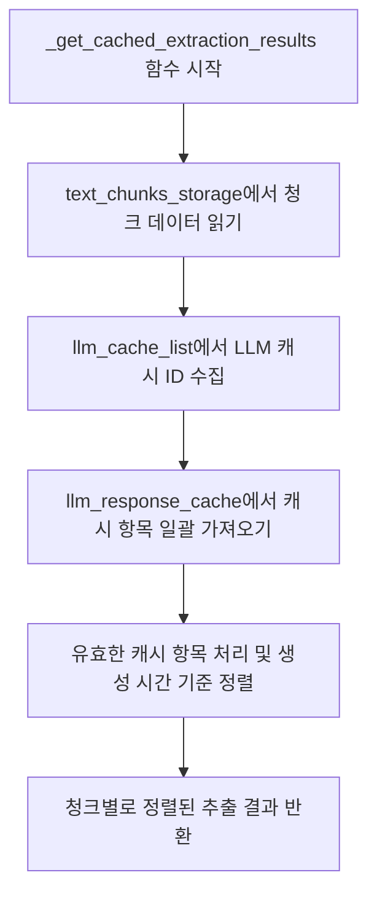
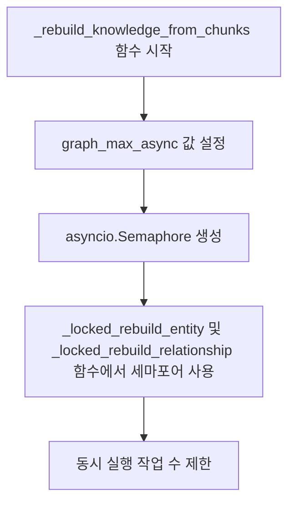
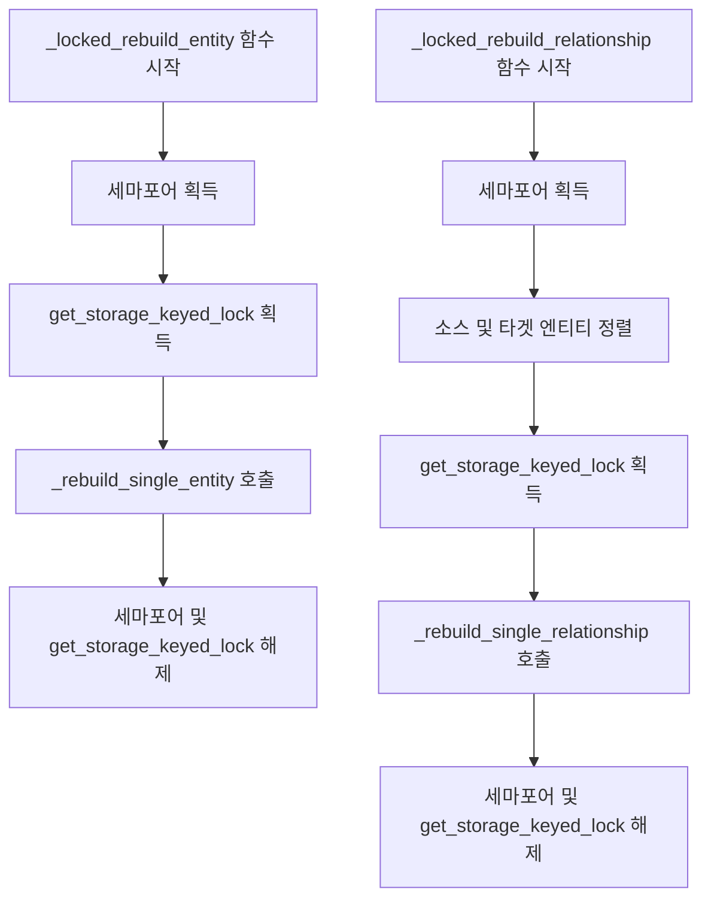
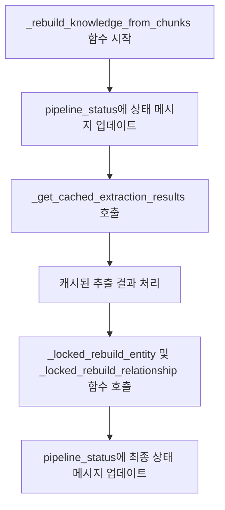

# 지식 그래프 재구성

<cite>
**이 문서에서 참조된 파일**   
- [operate.py](file://lightrag/operate.py)
- [shared_storage.py](file://lightrag/kg/shared_storage.py)
- [lightrag.py](file://lightrag/lightrag.py)
</cite>

## 목차
1. [소개](#소개)
2. [_rebuild_knowledge_from_chunks 함수 개요](#_rebuild_knowledge_from_chunks-함수-개요)
3. [캐시된 추출 결과 활용](#캐시된-추출-결과-활용)
4. [병렬 처리 및 동시성 제어](#병렬-처리-및-동시성-제어)
5. [리소스 경합 방지 메커니즘](#리소스-경합-방지-메커니즘)
6. [진행 상황 실시간 업데이트](#진행-상황-실시간-업데이트)
7. [결론](#결론)

## 소개
이 문서는 LightRAG 시스템에서 `_rebuild_knowledge_from_chunks` 함수가 캐시된 LLM 추출 결과를 활용하여 기존 지식 그래프를 재구성하는 과정을 상세히 설명합니다. 이 함수는 캐시된 결과를 가져오는 방식, 병렬 처리를 위한 동시성 제어 전략, 리소스 경합을 방지하는 메커니즘, 그리고 재구성 진행 상황을 실시간으로 업데이트하는 방법을 포함합니다.

## _rebuild_knowledge_from_chunks 함수 개요

`_rebuild_knowledge_from_chunks` 함수는 캐시된 LLM 추출 결과를 사용하여 엔티티와 관계 설명을 재구성합니다. 이 함수는 `llm_model_max_async`에 의해 제어되는 병렬 처리를 사용하며, `get_storage_keyed_lock`을 사용하여 데이터 일관성을 보장합니다. 함수는 엔티티와 관계를 재구성할 필요가 있는 경우에만 실행되며, 그렇지 않으면 즉시 반환됩니다.

**Section sources**
- [operate.py](file://lightrag/operate.py#L459-L703)

## 캐시된 추출 결과 활용

### _get_cached_extraction_results 함수
`_get_cached_extraction_results` 함수는 주어진 청크 ID에 대한 캐시된 LLM 추출 결과를 검색하고 생성 시간 기준으로 정렬하여 반환합니다. 이 함수는 두 가지 수준에서 정렬을 수행합니다:
1. 각 청크 내의 개별 추출 결과는 생성 시간(create_time) 기준으로 정렬됩니다.
2. 청크 자체는 첫 번째 추출 결과의 생성 시간 기준으로 정렬됩니다.

이 함수는 `text_chunks_storage`에서 청크 데이터를 읽고, `llm_cache_list`에서 LLM 캐시 ID를 수집합니다. 그런 다음 `llm_response_cache`에서 캐시 항목을 일괄적으로 가져와 처리합니다. 유효한 캐시 항목은 생성 시간과 함께 저장되며, 이후 생성 시간 기준으로 정렬됩니다.

**Diagram sources **
- [operate.py](file://lightrag/operate.py#L706-L795)

**Section sources**
- [operate.py](file://lightrag/operate.py#L706-L795)

## 병렬 처리 및 동시성 제어

### asyncio.Semaphore 사용
`_rebuild_knowledge_from_chunks` 함수는 `asyncio.Semaphore`를 사용하여 동시성 제어를 수행합니다. `graph_max_async`는 `global_config`에서 `llm_model_max_async` 값을 가져와 2를 곱한 값으로 설정됩니다. 이 세마포어는 `_locked_rebuild_entity` 및 `_locked_rebuild_relationship` 함수에서 사용되어, 동시에 실행되는 작업 수를 제한합니다.

**Diagram sources **
- [operate.py](file://lightrag/operate.py#L459-L703)

**Section sources**
- [operate.py](file://lightrag/operate.py#L459-L703)

## 리소스 경합 방지 메커니즘

### _locked_rebuild_entity 및 _locked_rebuild_relationship 함수
`_locked_rebuild_entity` 및 `_locked_rebuild_relationship` 함수는 세마포어와 `get_storage_keyed_lock`을 결합하여 리소스 경합을 방지합니다. `_locked_rebuild_entity` 함수는 엔티티 이름을 키로 사용하여 `get_storage_keyed_lock`을 획득합니다. `_locked_rebuild_relationship` 함수는 소스 및 타겟 엔티티를 정렬하여 순서에 관계없는 잠금 키를 생성합니다.

**Diagram sources **
- [operate.py](file://lightrag/operate.py#L459-L703)

**Section sources**
- [operate.py](file://lightrag/operate.py#L459-L703)

## 진행 상황 실시간 업데이트

### pipeline_status 사용
`_rebuild_knowledge_from_chunks` 함수는 `pipeline_status`를 통해 재구성 진행 상황을 실시간으로 업데이트합니다. `pipeline_status`는 `latest_message` 및 `history_messages` 필드를 포함하며, 각 단계에서 상태 메시지를 업데이트합니다. `pipeline_status_lock`은 `pipeline_status`에 대한 동시 접근을 방지합니다.

**Diagram sources **
- [operate.py](file://lightrag/operate.py#L459-L703)

**Section sources**
- [operate.py](file://lightrag/operate.py#L459-L703)

## 결론
`_rebuild_knowledge_from_chunks` 함수는 캐시된 LLM 추출 결과를 활용하여 기존 지식 그래프를 재구성하는 데 중요한 역할을 합니다. 이 함수는 `_get_cached_extraction_results` 함수를 통해 캐시된 결과를 가져오며, `asyncio.Semaphore`를 사용하여 병렬 처리를 제어합니다. `_locked_rebuild_entity` 및 `_locked_rebuild_relationship` 함수는 세마포어와 `get_storage_keyed_lock`을 결합하여 리소스 경합을 방지합니다. `pipeline_status`를 통해 재구성 진행 상황을 실시간으로 업데이트하여, 사용자가 현재 상태를 쉽게 확인할 수 있도록 합니다.