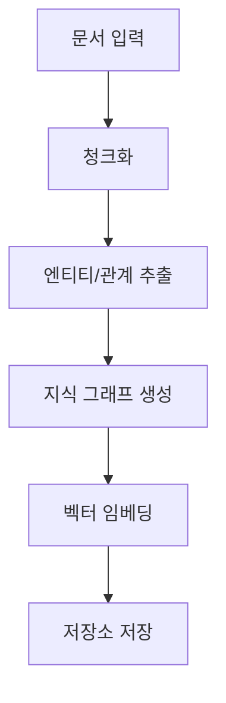

<docs>
# 핵심 기능

<cite>
**이 문서에서 참조한 파일**  
- [operate.py](file://lightrag\operate.py)
- [lightrag.py](file://lightrag\lightrag.py)
- [prompt.py](file://lightrag\prompt.py)
- [constants.py](file://lightrag\constants.py)
- [types.py](file://lightrag\types.py)
- [base.py](file://lightrag\base.py)
- [documents_standalone.py](file://upload\documents_standalone.py) - *새로 추가된 독립형 문서 API 스크립트*
</cite>

## 업데이트 요약
**변경 사항**   
- `upload/documents_standalone.py`에 새롭게 추가된 독립형 문서 API 기능을 반영하여 문서를 업데이트했습니다.
- "문서 처리 파이프라인" 섹션에 CLI를 통한 문서 스캔 및 업로드 기능을 설명하는 새로운 하위 섹션을 추가했습니다.
- 관련된 모든 파일 링크와 소스 추적 정보를 한국어로 완전히 변환하고, 새로 추가된 파일을 포함하도록 했습니다.

## 목차
1. [지식 그래프 기반 RAG 작동 원리](#지식-그래프-기반-rag-작동-원리)
2. [문서 처리 파이프라인](#문서-처리-파이프라인)
3. [검색 모드 비교 및 쿼리 처리 로직](#검색-모드-비교-및-쿼리-처리-로직)
4. [프롬프트 템플릿 역할 및 커스터마이징](#프롬프트-템플릿-역할-및-커스터마이징)
5. [주요 상수 및 데이터 구조](#주요-상수-및-데이터-구조)
6. [LightRAG 클래스 사용법](#lightrag-클래스-사용법)

## 지식 그래프 기반 RAG 작동 원리

LightRAG의 핵심 기능은 지식 그래프 기반 검색 증강 생성(RAG) 시스템으로, 문서의 의미적 구조를 추출하고 이를 기반으로 정확한 정보 검색을 수행합니다. 이 시스템은 단순한 텍스트 매칭을 넘어, 문서 내 실체(entity)와 관계(relationship)를 구조화하여 지식 그래프로 구성함으로써 복잡한 질의에 대한 정확한 답변을 가능하게 합니다. 지식 그래프는 문서의 핵심 개념과 그들 간의 연결을 시각화하고, 이를 통해 전역적인 맥락과 지역적인 세부 정보를 통합적으로 이해할 수 있습니다. 이 과정은 사용자가 제공한 문서를 분석하여 실체(예: 사람, 조직, 기술)와 그들 간의 관계(예: 협력, 연구)를 추출하고, 이를 벡터 임베딩과 결합하여 검색 성능을 극대화합니다.

**Section sources**
- [lightrag.py](file://lightrag\lightrag.py#L53-L109)
- [operate.py](file://lightrag\operate.py#L0-L799)

## 문서 처리 파이프라인

문서 처리 파이프라인은 사용자 입력 문서를 지식 기반으로 변환하는 일련의 단계로 구성됩니다. 이 파이프라인은 `operate.py` 파일에서 정의된 함수들에 의해 구현되며, 다음과 같은 순차적인 단계를 거칩니다.

**Diagram sources**
- [operate.py](file://lightrag\operate.py#L0-L799)
- [lightrag.py](file://lightrag\lightrag.py#L53-L109)

### 청크화

문서 처리의 첫 번째 단계는 청크화(chunking)입니다. `chunking_by_token_size` 함수는 입력된 텍스트를 지정된 토큰 크기(`chunk_token_size`)로 분할합니다. 이 과정에서 `overlap_token_size` 매개변수를 사용하여 인접한 청크 간에 일정량의 토큰을 중복시켜, 문맥의 연속성을 유지합니다. 이는 문장이 청크의 경계에서 잘리는 것을 방지하고, 후속 처리 단계에서 더 정확한 의미 분석을 가능하게 합니다. 청크화는 문서의 긴 텍스트를 LLM의 컨텍스트 창 크기에 맞게 관리 가능한 단위로 나누는 핵심적인 전처리 단계입니다.

**Section sources**
- [operate.py](file://lightrag\operate.py#L0-L799)

### 엔티티/관계 추출

청크화된 각 텍스트 조각은 `extract_entities` 함수를 통해 분석됩니다. 이 함수는 LLM을 활용하여 각 청크 내에서 지정된 유형(예: `person`, `organization`, `technology`)의 엔티티와 그들 간의 관계를 추출합니다. 추출 과정은 `prompt.py`에 정의된 `entity_extraction` 프롬프트 템플릿을 사용하여 수행되며, LLM은 텍스트를 분석하여 엔티티 이름, 유형, 설명 및 관계의 설명, 강도, 키워드를 구조화된 형식으로 출력합니다. 이 과정은 문서의 비구조화된 텍스트를 구조화된 지식으로 변환하는 핵심 단계입니다.

**Section sources**
- [operate.py](file://lightrag\operate.py#L0-L799)
- [prompt.py](file://lightrag\prompt.py#L0-L332)

### 지식 그래프 생성

추출된 엔티티와 관계는 `merge_nodes_and_edges` 함수를 통해 기존의 지식 그래프와 병합됩니다. 이 과정에서 동일한 이름의 엔티티는 하나로 통합되며, 여러 청크에서 추출된 설명은 `handle_entity_relation_summary` 함수를 통해 요약됩니다. 요약은 맵-리듀스 방식으로 수행되며, 설명의 총 토큰 수가 일정 임계값을 초과하면 LLM을 사용하여 요약을 생성합니다. 최종적으로 통합된 노드(엔티티)와 엣지(관계)는 `BaseGraphStorage` 인터페이스를 통해 지식 그래프 저장소(예: NetworkX, Neo4j)에 저장되어 지식 그래프가 생성됩니다.

**Section sources**
- [operate.py](file://lightrag\operate.py#L0-L799)
- [base.py](file://lightrag\base.py#L44-L92)

### 벡터 임베딩

생성된 지식 그래프 외에도, 청크화된 원본 텍스트는 의미적 검색을 위해 벡터 임베딩됩니다. `embedding_func`에 의해 제공되는 임베딩 모델은 각 텍스트 청크를 고차원 벡터 공간의 점으로 변환합니다. 이러한 벡터는 `BaseVectorStorage` 인터페이스를 통해 벡터 데이터베이스(예: Milvus, Qdrant)에 저장됩니다. 이 벡터 임베딩은 "나이브" 및 "하이브리드" 검색 모드에서 텍스트 유사도 기반 검색을 가능하게 하며, 지식 그래프의 구조적 검색과 보완적인 역할을 합니다.

**Section sources**
- [lightrag.py](file://lightrag\lightrag.py#L53-L109)
- [base.py](file://lightrag\base.py#L44-L92)

### CLI를 통한 문서 스캔 및 업로드

최근 코드 변경